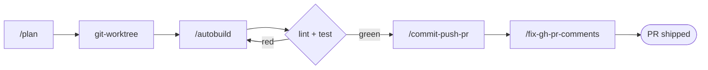

# boss-skills

Personal Claude Code plugin marketplace spanning developer-experience tooling, homelab
infrastructure, and social-media content creation.

## Installation

Add this marketplace to Claude Code:

```bash
/plugin marketplace add bossjones/boss-skills
```

Then install individual plugins:

```bash
/plugin install agent-harness@boss-skills
/plugin install basedpyright-lsp@boss-skills
/plugin install twitter-tools@boss-skills
```

## Available Plugins

Full per-plugin documentation — components, install commands, and usage examples — lives in
[`docs/plugins/`](docs/plugins/README.md). For hands-on, step-by-step walkthroughs, see
[`docs/tutorials/`](docs/tutorials/README.md).

| Plugin | Category | Version | Description | Docs |
|--------|----------|---------|-------------|------|
| [agent-harness](#boss-devagent-harness) | `boss-dev` | 0.14.0 | Subagents, commands, hooks, and skills for agentic dev workflows | [↗](docs/plugins/agent-harness.md) |
| [basedpyright-lsp](#boss-devbasedpyright-lsp) | `boss-dev` | 0.1.1 | Wire basedpyright into Claude Code for real-time Python diagnostics | [↗](docs/plugins/basedpyright-lsp.md) |
| python-dev | `boss-dev` | 0.1.1 | Debug GitHub Actions CI and ship conventional-commit PRs | [↗](docs/plugins/python-dev.md) |
| [github-pr-review](#boss-devgithub-pr-review) | `boss-dev` | 1.1.1 | Approval-gated GitHub PR reviews with inline code suggestions (external) | [↗](docs/plugins/github-pr-review.md) |
| [twitter-tools](#social-mediatwitter-tools) | `social-media` | 0.1.1 | Download X/Twitter media and convert tweets to Reels | [↗](docs/plugins/twitter-tools.md) |
| proxmox-infra | `boss-homelab` | 0.1.1 | Manage Proxmox VE homelab infrastructure and IaC | [↗](docs/plugins/proxmox-infra.md) |

### boss-dev/agent-harness

Agent harness tooling for Claude Code: subagents, commands, hooks, skills, and scripts that build
and operate agentic dev workflows. It bundles a GitHub PR-review workflow, a git-worktree
lifecycle, and a release-notes generator, plus planning/priming/shipping commands and a roster of
subagents.

```bash
/plugin install agent-harness@boss-skills
```

**Components:**

| Component | Count | Active on install? |
|-----------|-------|--------------------|
| Skills | 14 | Yes |
| Commands | 13 | Yes |
| Agents | 6 | Yes |
| Output styles | 8 | Yes |
| Hooks | 13 | Manual wiring |
| Status lines | 10 | Manual wiring |

The planning and shipping commands chain into a single isolated feature loop:



```text
/agent-harness:prime
/agent-harness:plan add a --json flag to the download script
/agent-harness:autobuild specs/add-json-flag.md   # run inside a git worktree
```

See [`plugins/boss-dev/agent-harness/README.md`](plugins/boss-dev/agent-harness/README.md) or the
[expanded docs](docs/plugins/agent-harness.md) for the full component reference.

### boss-dev/basedpyright-lsp

LSP plugin that wires [basedpyright](https://docs.basedpyright.com/) into Claude Code — real-time
Python diagnostics, hover docs, go-to-definition, and find-references for `.py`/`.pyi`/`.pyw` files.
basedpyright is a strict superset of pyright that re-adds semantic tokens, inlay hints, and baseline
files, and ships as a single binary.

```bash
uv tool install basedpyright          # prerequisite: language server on PATH
/plugin install basedpyright-lsp@boss-skills
```

**Capabilities:**

| Capability | Description |
|------------|-------------|
| Real-time diagnostics | Type errors surface as you edit, in the `/plugin` Errors tab |
| Hover / definition / references | Inferred types, docstrings, and symbol navigation |
| Semantic tokens & inlay hints | Richer highlighting and inline type annotations |
| Baseline files | Suppress pre-existing findings so only new issues surface |

Configure strictness per-project via `pyrightconfig.json` or `[tool.basedpyright]` in
`pyproject.toml`. See
[`plugins/boss-dev/basedpyright-lsp/README.md`](plugins/boss-dev/basedpyright-lsp/README.md) or the
[expanded docs](docs/plugins/basedpyright-lsp.md) for prerequisites and troubleshooting.

### boss-dev/python-dev

Python development tooling for Claude Code: debug GitHub Actions CI failures end-to-end and ship
changes via conventional-commit pull requests. Assumes a `uv`-based project with `ruff`, `ty`,
`deptry`, `pre-commit`, and `mkdocs`.

```bash
/plugin install python-dev@boss-skills
```

**Commands:**

| Command | Description |
|---------|-------------|
| `/python-dev:debug-ci` | Diagnose a failed GitHub Actions run, fix it locally, validate, push, and poll until green (up to 3 cycles) |
| `/python-dev:commit-push-pr` | Stage changes, write a conventional commit, push, and open/update a PR via `gh` |
| `/python-dev:fix-gh-pr-comments` | Fetch unresolved PR review comments, apply fixes, push, and reply per thread (up to 3 cycles) |

See the [expanded docs](docs/plugins/python-dev.md) for project assumptions and usage examples.

### boss-dev/github-pr-review

Professional GitHub PR reviews with pending reviews, code suggestions, and a user-approval workflow
via the `gh` CLI. Ask Claude to *"Review PR #123 and suggest improvements"* and it drafts the review,
shows you exactly what will be posted, and only submits after you approve.

```bash
/plugin install github-pr-review@boss-skills
```

> **External plugin.** This is the marketplace's first remote entry — it is **not** vendored into
> this repo. It is authored by [Aidan Kinzett](https://github.com/aidankinzett) (MIT) and referenced
> as a `git-subdir` source pinned to `v1.1.1` (`sha 3660dca…`), so it never updates silently. See the
> [integration spec](specs/claude-git-pr-skill.md) for the pin/update procedure.

Walk through it end to end in the
[github-pr-review tutorial](docs/tutorials/github-pr-review/README.md), or see the
[expanded docs](docs/plugins/github-pr-review.md) for the install fallback and full workflow.

### social-media/twitter-tools

Twitter/X social media tools for downloading media and converting tweets to Instagram Reels format.

```bash
/plugin install twitter-tools@boss-skills
```

**Skills included:**

| Skill | Description |
|-------|-------------|
| `twitter-media-downloader` | Download images and videos from X/Twitter using gallery-dl |
| `twitter-to-reel` | Convert tweets to Instagram Reels format (9:16 vertical video) |

**Features:**

- Download media from tweets, user profiles, timelines, likes, and bookmarks
- Support for protected content via browser cookie extraction
- Automatic video download and reel composition in a single command
- Theme auto-detection (light/dark) for seamless background matching
- JSON output mode for programmatic integration

See [`plugins/social-media/twitter-tools/README.md`](plugins/social-media/twitter-tools/README.md) for details.

### boss-homelab/proxmox-infra

Homelab Proxmox VE tooling for Claude Code: a single comprehensive skill for managing nodes, VMs, LXC
containers, storage, and networking via the [proxmoxer](https://github.com/proxmoxer/proxmoxer)
Python library, Ansible (`community.general.proxmox`), and Terraform/OpenTofu (the Telmate provider).

```bash
/plugin install proxmox-infra@boss-skills
```

The `proxmox-infrastructure` skill bundles reference docs (cloud-init, networking, storage), helper
scripts (cluster/Ceph health checks, template validation), multi-step workflows (cluster formation,
Ceph deployment), and a worked example. Ask it in natural language to provision a VM from a
cloud-init template or to check the health of your Proxmox cluster.

See the [expanded docs](docs/plugins/proxmox-infra.md) for bundled resources and usage examples.

## Second Brain (obsidian-wiki)

Optional: [`obsidian-wiki`](https://github.com/ar9av/obsidian-wiki) adds a "second brain" —
an AI-maintained Obsidian knowledge base. Install it as a global uv tool (not pip) and run
its one-time setup:

```bash
uv tool install "obsidian-wiki[graph,ast]"
obsidian-wiki setup --vault ~/Documents/obsidian/personal.vault
```

Or run the `setup-second-brain` skill (agent-harness plugin) to do the whole thing —
detect, preview, install, configure the vault, and optionally set up
[QMD](https://github.com/tobi/qmd) semantic search (`npm install -g @tobilu/qmd`, Node ≥ 22).

Setup symlinks the wiki skills into `~/.claude/skills/` and persists the vault path in
`~/.obsidian-wiki/config`. See the "Second Brain (obsidian-wiki)" section in
[`CLAUDE.md`](CLAUDE.md) and `OBSIDIAN_VAULT_PATH` / the `QMD_*` vars in
[`plugins/boss-dev/agent-harness/docs/getting-started.md`](plugins/boss-dev/agent-harness/docs/getting-started.md).

## Quick Start Examples

### Download Twitter Media

```bash
# Download all media from a user
uv run python scripts/download.py "https://x.com/NASA" --output ./downloads

# Download only videos from a tweet
uv run python scripts/download.py "https://x.com/user/status/123" --videos-only

# Download with authentication
uv run python scripts/download.py "https://x.com/i/bookmarks" --browser firefox
```

### Create Instagram Reels from Tweets

```bash
# Auto-download video and create reel (recommended)
uv run python scripts/create_reel.py "https://x.com/user/status/123" -o reel.mp4

# With authentication for protected tweets
uv run python scripts/create_reel.py "https://x.com/user/status/123" --browser firefox -o reel.mp4

# With explicit video file
uv run python scripts/create_reel.py "https://x.com/user/status/123" video.mp4 -o reel.mp4
```

## Documentation

| Guide | For |
|-------|-----|
| [docs/](docs/README.md) | Index of all documentation |
| [docs/plugins/](docs/plugins/README.md) | Per-plugin reference pages |
| [docs/tutorials/](docs/tutorials/README.md) | Hands-on usage walkthroughs |
| [CONTRIBUTING.md](CONTRIBUTING.md) | How to add a new plugin or skill |
| [development.md](development.md) | Local dev environment and `make` targets |
| [installation.md](installation.md) | uv / Python prerequisites |
| [publishing.md](publishing.md) | Releasing a new or updated plugin |
| [CHANGELOG.md](CHANGELOG.md) | Release history |

## Development

### Prerequisites

- Python 3.11+
- [uv](https://docs.astral.sh/uv/) package manager
- FFmpeg (for video processing)

### Commands

```bash
# Install dependencies
make install

# Run linting (ruff + basedpyright)
make lint

# Run tests
make test

# Run all checks
make
```

### Skill Quality

Skills are quality-gated with [`plugin-eval`](https://github.com/wshobson/agents/tree/main/plugins/plugin-eval),
vendored in-repo at `scripts/plugin_eval/` as a locally-patched copy and built on
demand via `uvx` (set `PLUGIN_EVAL_SOURCE` to evaluate against a different revision).

```bash
# Report static scores for every skill (never fails)
make eval

# Quality gate used by CI: fail if any skill < EVAL_THRESHOLD
make eval-ci

# Override the floor ad hoc
make eval-ci EVAL_THRESHOLD=70

# Deep-dive one skill at standard depth (LLM judge; uses Claude Code Max)
make eval-skill SKILL=plugins/social-media/twitter-tools/skills/twitter-to-reel
```

`make eval-ci` runs in CI at static (`quick`) depth — deterministic, no API key
required. `EVAL_THRESHOLD` (in the `Makefile`) is a regression floor set to
`min(baseline scores) - 5`; bump it as skills improve.

For interactive use, install the Claude Code plugin from the already-registered
marketplace (these are user-typed slash commands, not repo scripts):

```text
/plugin install plugin-eval@claude-code-workflows
/plugin marketplace update claude-code-workflows   # pull the latest on demand
```

Enable autoUpdate on the `claude-code-workflows` marketplace if you want plugin
updates without the manual `marketplace update`. This gives you `/eval`,
`/certify`, and `/compare` while iterating on skills.

**Escape hatch:** if upstream `plugin-eval` changes ever make the gate flaky,
pin a known-good revision without editing code:

```bash
PLUGIN_EVAL_SOURCE='git+https://github.com/wshobson/agents.git@<sha>#subdirectory=plugins/plugin-eval' make eval-ci
```

### Project Structure

```text
boss-skills/
├── plugins/
│   ├── boss-dev/
│   │   ├── agent-harness/      # subagents, commands, hooks, skills, status lines
│   │   ├── basedpyright-lsp/   # Python LSP integration (.lsp.json)
│   │   └── python-dev/         # CI debugging + conventional-commit PR commands
│   ├── boss-homelab/
│   │   └── proxmox-infra/      # Proxmox VE infrastructure skill
│   └── social-media/
│       └── twitter-tools/      # media download + tweet-to-Reel skills
├── docs/
│   ├── plugins/                # expanded per-plugin documentation
│   └── tutorials/              # hands-on, plugin-first usage walkthroughs
├── devtools/
├── scripts/
└── tests/
```

## Dependencies

The twitter-tools plugin requires:

- **gallery-dl** - Media download engine
- **yt-dlp** - Video download support (optional but recommended)
- **playwright** - Browser automation for screenshots
- **pillow** - Image processing
- **FFmpeg** - Video composition

Install with:

```bash
pip install gallery-dl yt-dlp playwright pillow numpy
playwright install chromium
brew install ffmpeg  # macOS
```

## License

MIT
