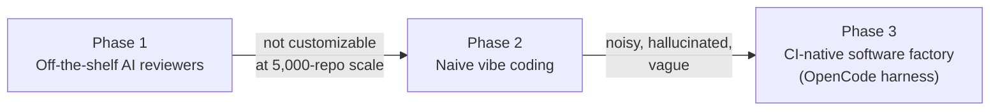
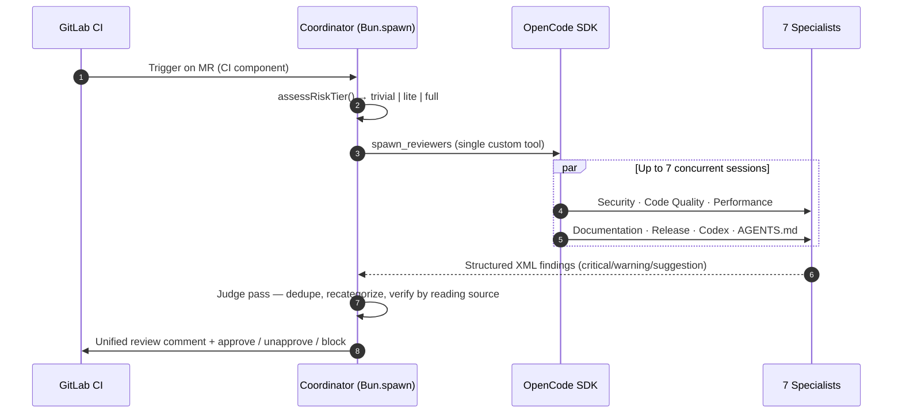

# Cloudflare's AI Code Review Software Factory

A technical breakdown of Cloudflare's CI-native AI code review system, written as a build
reference for anyone constructing a comparable software factory.

**Sources**

- **[blog]** — [Cloudflare: How we built AI code review](https://blog.cloudflare.com/ai-code-review/) (Ryan Skidmore). Operational detail, code, metrics.
- **[video]** — IndyDevDan, *"I Ranked Cloudflare's Software Factory and Wow… S TIER TOKENOMICS"* ([`YG4t7aMY81c`](https://www.youtube.com/watch?v=YG4t7aMY81c)). The agentic-engineering critique and tier list. Rankings and quotes below were checked against the video's full transcript; that transcript is kept as a local-only working artifact (`ai_docs/sources/`, gitignored) rather than republished here.
- **[inference]** — my own reading, not stated by either source. Tagged so you don't build on it by accident.

Every non-obvious claim below carries one of those three tags. Where the two sources disagree or
one is silent, the tag tells you how much weight to put on it.

---

## 1. Executive summary

Cloudflare replaced the human-review bottleneck with a CI-triggered team of AI agents. It is not a
prompt wrapper: it's an orchestrated, plugin-based harness around [OpenCode](https://opencode.ai)
that runs a coordinator agent over up to seven specialists, scales its own compute to the risk of
the change, and blocks merges when it finds something genuinely dangerous.

### Measured results — first 30 days in production (Mar 10 – Apr 9, 2026) [blog]

| Metric | Value |
| :--- | :--- |
| Review runs | 131,246 |
| Merge requests reviewed | 48,095 |
| Repositories covered | 5,169 |
| Re-reviews per MR | 2.7x average |
| Findings surfaced | 159,103 (~1.2 per review) |
| Tokens processed | 120 billion |
| Cache hit rate | **85.7%** |
| Median review duration | **3m 39s** |
| Median cost per review | **$0.98** (avg $1.19, P99 $4.45) |
| "Break glass" overrides | 288 (**0.6%** of MRs) |

The headline number is the cost. A merge request gets a full multi-agent review for about a
dollar, against a human reviewer who costs minutes-to-hours of salaried attention and days of
latency. That gap is the entire thesis. [video]

### The receipt: cost by risk tier [blog]

This is the single most important table in the whole write-up. It's the proof that risk-tiering
compute actually works, and it's the number to beat when you build your own.

| Tier | Reviews | Avg cost | Median | P95 | P99 |
| :--- | ---: | ---: | ---: | ---: | ---: |
| Trivial | 24,529 | $0.20 | $0.17 | $0.39 | $0.74 |
| Lite | 27,558 | $0.67 | $0.61 | $1.15 | $1.95 |
| Full | 78,611 | $1.68 | $1.47 | $3.35 | $5.05 |

An 8x spread between the cheapest and most expensive tier. Roughly 40% of all reviews never pay
full price.

---

## 2. The problem being solved

Cloudflare's own framing: code review is a great mechanism for catching bugs and sharing
knowledge, and it is also one of the most reliable ways to bottleneck an engineering team. [blog]

Dan sharpens this into a claim worth internalizing: **in the age of agents there are only two
constraints left — planning and reviewing.** Generation is no longer scarce. Work piles up at the
two ends where humans still gate it. Cloudflare chose to attack the *review* constraint and left
planning alone. [video]

The failure loop they're breaking:

1. Author opens an MR and immediately starts losing context on it.
2. The MR sits in a queue. Median time-to-first-review is measured in **hours**.
3. A reviewer context-switches out of their own work to read the diff.
4. They leave a handful of nitpicks.
5. Author context-switches back, responds, and the cycle repeats.

With an AI review landing in ~3.5 minutes, the author never leaves flow state, and the human
reviewer (when one is still needed) arrives to a diff that's already been cleaned of the obvious
problems. [video]

---

## 3. How they got there

Nobody starts with a good review system. Cloudflare went through two dead ends first, and both are
worth knowing because you will be tempted by them. [blog]



**Phase 1 — Off-the-shelf tools.** They worked "pretty well." The recurring blocker was that none
offered enough flexibility or customization for an org of Cloudflare's size.

Dan's read on this is the specialization thesis, and it generalizes: **if you are solving a real
problem, you have built a custom solution — because custom solutions are by nature specialized.**
Out-of-the-box agents, prompts and skills will not solve your problem the way you can solve it.
This is *why* they left the vendors, not just that they did. [video]

**Phase 2 — Vibe coding.** Grab the diff, shove it into a half-baked prompt, ask the model to find
bugs. Result: noise, vague instructions, hallucinated syntax errors, and the immortal
"consider adding error handling" on a function that already handles errors.

**Phase 3 — A CI-native orchestration system.** Not a monolithic review agent — a factory. CI is
the trigger; the orchestration system takes it from there.

---

## 4. Architecture

Two layers: a coordinator process spawned by CI, and specialist sub-agent sessions spawned through
the OpenCode SDK.



### The coordinator process [blog]

Spawned as a child process via `Bun.spawn`, running OpenCode with `--format json`.

The detail worth stealing: **the prompt is piped in on `stdin`, not passed as a command-line
argument.** They learned this from `E2BIG` errors on large MRs — a big MR description plus logs
plus diffs blows past the Linux kernel's `ARG_MAX` limit. If you shell out to an agent with a
large prompt, you will hit this eventually.

```typescript
const proc = Bun.spawn(
  ["bun", opencodeScript, "--print-logs", "--log-level", logLevel,
   "--format", "json", "--agent", "review_coordinator", "run"],
  {
    stdin: Buffer.from(prompt),          // NOT argv — avoids ARG_MAX / E2BIG
    env: { ...sanitizeEnvForChildProcess(process.env),
           OPENCODE_CONFIG: process.env.OPENCODE_CONFIG_PATH ?? "",
           BUN_JSC_gcMaxHeapSize: "2684354560" },
    stdout: "pipe",
    stderr: "pipe",
  }
);
```

### Why OpenCode [blog]

Three reasons, and the third is the one that matters:

1. They already used it internally — they knew how it behaved. Dan flags this as a mark of a
   serious team: **they reach for tools they understand, not the new flashy thing.** [video]
2. Open source, so they can upstream their own features.
3. **It has a real SDK for programmatic session creation.** Dan's line: any agentic coding tool
   without programmatic access isn't a legitimate agentic coding tool. [video]

### The seven specialists [blog]

| Agent | Scope |
| :--- | :--- |
| Security | Exploitable, concrete vulnerabilities only |
| Code Quality | Logic errors, patterns |
| Performance | Speed and efficiency regressions |
| Documentation | Doc completeness |
| Release Management | Release readiness |
| Codex Compliance | Adherence to Cloudflare's internal engineering RFCs |
| AGENTS.md | Staleness of AI instruction files (see §5.H) |

Each runs in its own OpenCode session. The coordinator does not see or control which tools a
sub-reviewer uses — it only receives structured XML findings back.

### The plugin architecture [blog]

Nothing about GitLab or any specific LLM provider is coupled to the review engine. Every plugin
implements a `ReviewPlugin` interface with three lifecycle phases:

| Phase | Execution | On failure |
| :--- | :--- | :--- |
| `bootstrap` | Concurrent | Non-fatal — review proceeds |
| `configure` | Sequential | **Fatal** — CI job halts |
| `postConfigure` | Sequential, after config assembly | Non-fatal |

Plugins contribute through a `ConfigureContext` API and are isolated from one another: the GitLab
VCS plugin cannot read the Cloudflare AI Gateway plugin's credentials. The core assembler compiles
every contribution into a single `opencode.json` that OpenCode consumes.

The shipped roster:

| Plugin | Role |
| :--- | :--- |
| `@opencode-reviewer/gitlab` | VCS provider, MR data, MCP comment server |
| `@opencode-reviewer/cloudflare` | AI Gateway, model tiers, failback chains |
| `@opencode-reviewer/codex` | Internal compliance checking |
| `@opencode-reviewer/braintrust` | Distributed tracing |
| `@opencode-reviewer/agents-md` | AGENTS.md validation |
| `@opencode-reviewer/reviewer-config` | Remote model overrides (Workers KV) |
| `@opencode-reviewer/telemetry` | Fire-and-forget tracking |
| `@opencode-reviewer/local` | Local `/fullreview` in the OpenCode TUI |

Dan rates this an **A** and gives it a name — the **extensible factory**. Across 5,000 codebases
and a large org, the plugin system is what preserves customization, adaptability and extensibility
without forking the engine. [video]

---

## 5. The engineering distinctions

### A. Agents + code, not agents alone [video]

Dan's most transferable framing, and the one the original write-up missed entirely.

The `spawn_reviewers` "tool" is not really a tool — it kicks off an entire program: risk
assessment, patch generation, concurrent session management, timeouts, retries, failbacks. It's a
deterministic code pipeline with agents embedded at the points where judgment is needed.

> "Agents plus code is how you outperform agents alone and how you outperform code."

The reasoning: agents are non-deterministic, which has an upside (judgment, generalization) and a
downside (unreliability). Code is deterministic — no upside, no downside. You need both, so that
the code layer can manage the agent layer's downside while still capturing its upside. Rated
**A-tier**.

### B. Risk-tiered compute [blog]

Running seven frontier-model agents on a typo fix is arson. Cloudflare assesses every MR first:

```typescript
function assessRiskTier(diffEntries: DiffEntry[]) {
  const totalLines = diffEntries.reduce((sum, e) => sum + e.addedLines + e.removedLines, 0);
  const fileCount = diffEntries.length;
  const hasSecurityFiles = diffEntries.some(e => isSecuritySensitiveFile(e.newPath));

  if (fileCount > 50 || hasSecurityFiles) return "full";
  if (totalLines <= 10 && fileCount <= 20) return "trivial";
  if (totalLines <= 100 && fileCount <= 20) return "lite";
  return "full";
}
```

| Tier | Conditions | Agents | Coordinator model |
| :--- | :--- | :--- | :--- |
| **Trivial** | ≤10 lines, ≤20 files | 2 (coordinator + 1 generalist reviewer) | **Sonnet** (downgraded) |
| **Lite** | ≤100 lines, ≤20 files | 4 (coordinator + code quality + docs + 1 more) | **Opus** |
| **Full** | >100 lines, or >50 files, or any security-sensitive path | 7+ (all specialists) | **Opus** |

Note the two things the original doc got wrong: **only Trivial downgrades the coordinator to
Sonnet.** Lite still runs Opus. And touching `auth/`, `crypto/` or any security-sensitive path
forces Full regardless of how small the diff is — size is not the only axis of risk.

Dan: *"Don't send in the dream team to review a typo fix."* This, more than anything else, is what
buys the S-tier tokenomics. [video]

### C. Context engineering: patch scoping and shared context [blog]

Duplicating a moderately-sized MR's full metadata and diff across seven concurrent sub-agents
multiplies your token cost by **7x**. Three mitigations:

- **Diff-patch scoping** — the coordinator writes each file's changes as a patch file into a
  `diff_directory` and passes only the *relevant paths* to each specialist. The security reviewer
  doesn't read the CSS.
- **Shared context file** — MR description, comments and metadata are written once to
  `shared-mr-context.txt`. Sub-agents read it from disk instead of each carrying a copy in-prompt.
- **Noise filtering, before any model sees anything** — lock files (`bun.lock`,
  `package-lock.json`, `yarn.lock`, `pnpm-lock.yaml`, `Cargo.lock`, `go.sum`, `poetry.lock`,
  `Pipfile.lock`, `flake.lock`), minified assets (`.min.js`, `.min.css`, `.bundle.js`) and
  sourcemaps (`.map`) are stripped. Files marked `// @generated` are skipped — **but database
  migrations are explicitly exempted**, because a schema change is exactly what you want reviewed.

Dan's compression of this: **R&D — Reduce and Delegate.** Reduce what's in any one context window;
delegate the rest to a specialist with its own window. Agent specialization and multi-agent
orchestration are, in this light, context-management techniques as much as quality techniques.
Rated **A-tier**. [video]

### D. Tokenomics [video]

Dan's definition, and the reason this is the S-tier item:

> Tokenomics is the skill of using tokens, generating value, and then arbitraging that value for
> more than it costs.

A three-step loop: **spend tokens → generate value → capture more than you spent.** Most teams stop
at step one — he calls this "token maxing," the lowest-hanging fruit and the fastest way to destroy
your unit economics. Throwing the best model at every task is the canonical version of this
mistake.

The counter-move is a **model stack** — deliberately tiered, with an explicit policy about when
each tier deploys. As you climb the stack you trade cost and speed for capability, and that trade
is only worth making sometimes.

| Tier | Models | Used for | Share of cost |
| :--- | :--- | :--- | ---: |
| Top | Claude Opus 4.7, GPT-5.4 | Coordinator only | 51.8% |
| Standard | Claude Sonnet 4.6, GPT-5.3 Codex | Heavy-lifting sub-reviewers | 46.2% |
| Lightweight | Kimi K2.5 (on Workers AI) | Text-heavy tasks | **0.0%** |

Dan's point about out-of-loop work: if your agents run while you're AFK — which is the whole point
of a software factory — **you cannot afford top-tier models everywhere.** It does not scale, and it
gets worse as you grow. [video]

The other half of the tokenomics story is the **85.7% cache hit rate**. Dan flags this as the part
he wants to study more; the blog doesn't fully explain how they got it that high. Treat it as a
target, not a recipe. [inference: the stable, per-agent system prompts plus the on-disk shared
context file are the obvious structural reasons a cache would hit this well.]

### E. JSONL streaming: observability that survives a crash [blog]

The child process emits **JSONL** — one self-contained JSON object per line — on stdout, not a
single JSON document.

The reason is failure. A standard JSON file needs its closing brackets to be parseable. If the
process crashes, times out, or OOMs, you get an unterminated document and your debug log is
garbage *at exactly the moment you need it*. With JSONL, the file is valid at every instant, so
it's streamable, appendable and parseable mid-flight.

- **Buffering:** flush every 100 lines or 50ms, to keep `appendFileSync` off the hot path.
- **Cost + truncation tracking:** the stream watcher listens for `step_finish` events. A step that
  finishes with `reason: "length"` means the model hit `max_tokens` and got cut off mid-sentence →
  automatic retry.
- **UI:** Braintrust for distributed tracing.

Dan bumps observability to **A** on the strength of this — plus the fact that they can answer
*which agent is paying the bills* (§5.J). His rule: if you don't measure what your agents are
doing, you cannot improve them. [video]

### F. Resilience: circuit breakers and failback chains [blog]

With seven concurrent frontier-model calls per review at this volume, rate limits and provider
outages aren't a risk — they're a schedule.

- **Circuit breakers** per model tier: Closed (healthy) → Open (failing) → Half-Open (probe).
  After a 2-minute cooldown, the circuit lets exactly **one** probe request through to test
  recovery. This is what stops the retry stampede that would otherwise hammer a recovering
  provider.
- **Failback chains** — cascade *within the same model family* to preserve prompt compatibility:

  ```json
  {
    "opus-4-7":   "opus-4-6",
    "opus-4-6":   null,
    "sonnet-4-6": "sonnet-4-5",
    "sonnet-4-5": null
  }
  ```

- **Error classification** — decide whether swapping the model could possibly help:
  - `APIError` with `isRetryable=true` (429, 503) → **failback**.
  - `ProviderAuthError`, `ContextOverflowError`, `MessageAbortedError` → **do not failback**. A
    different model won't fix a bad API key or a prompt that's too long; retrying just burns
    tokens.
- **Coordinator-level hot-swap** — if the coordinator process itself dies with "overloaded" or
  "503" in stderr, the orchestrator rewrites the model in `opencode.json` and re-runs.

**Timeouts and concurrency:**

| Control | Value |
| :--- | :--- |
| Concurrent reviewer sessions | 7 |
| Per-task timeout | 5 min (10 min for code quality) |
| Overall timeout | 25 min |
| Minimum retry budget | 2 min |
| Idle detection | `session.idle` events + 3s polling |
| Inactivity kill | 60s with no output |

Dan rates resilience **S-tier**, alongside tokenomics. His framing: if you're building one-shot
systems you assume will work 100% of the time, you're not engineering — you're vibe coding. [video]

### G. The control plane: change models in 5 seconds without a deploy [blog]

Model routing is **not** hardcoded in CI. A Cloudflare Worker backed by Workers KV serves the
config, and **every running CI job picks up a change within 5 seconds.**

The config carries per-reviewer model assignments, failback chain overrides, and a `providers`
block that can disable an entire provider at once:

```typescript
function filterModelsByProviders(models, providers) {
  return models.filter((m) => {
    const provider = extractProviderFromModel(m.model);
    if (!provider) return true;
    const config = providers[provider];
    if (!config) return true;
    return config.enabled;
  });
}
```

Anthropic having a bad day? Flip a KV value; every in-flight job routes around it. No code push, no
CI redeploy. This is what earns **Model Flexibility** its **A-tier**. [video]

### H. Heartbeat logs: managing developer psychology [blog]

A reasoning model can spend 30–90 seconds thinking before it emits a token. To a developer watching
a CI job, silence looks like a hang — so they cancel the job.

The fix is a background loop printing `"Model is thinking… (Ns since last output)"` every 30
seconds. That's it. It measurably reduced manual job cancellations.

A reminder that in a system humans watch, **perceived liveness is a feature**.

### I. Prompt engineering [blog]

Two techniques, and together they're what earn prompt engineering an **A**. [video]

**1. Negative scoping — tell the model what NOT to flag.** Dan singles this out as underused, and
admits he doesn't use it enough himself. Without explicit negative boundaries, specialists produce
a firehose of speculative nitpicks. The Security reviewer's prompt, abridged:

```markdown
## What to Flag
- Injection vulnerabilities (SQL, XSS, command, path traversal)
- Authentication / authorisation bypasses
- Hardcoded secrets, credentials, API keys
- Insecure cryptographic usage
- Missing input validation on untrusted data

## What NOT to Flag
- Theoretical risks that require highly unlikely preconditions
- Defense-in-depth suggestions when primary defenses are already adequate
- Security issues in unchanged files this MR does not affect
- "Consider using library X" style subjective suggestions
```

**2. Structured XML output with severity classification.** Every reviewer returns findings in a
fixed XML shape with one of three severities:

| Severity | Meaning |
| :--- | :--- |
| `critical` | Outage-causing or exploitable |
| `warning` | Measurable regression or concrete risk |
| `suggestion` | Improvement worth considering |

**3. Prompt-injection defense.** Anything sourced from user input — MR body, comments, previous
reviews — gets its boundary tags stripped before it enters a prompt, so an MR description can't
close a tag and issue instructions:

```text
PROMPT_BOUNDARY_TAGS = mr_input, mr_body, mr_comments, mr_details, changed_files,
  existing_inline_findings, previous_review, custom_review_instructions,
  agents_md_template_instructions
```

Applied as a case-insensitive global regex: `</?(?:${PROMPT_BOUNDARY_TAGS.join("|")})[^>]*>`.

Non-negotiable if you ingest attacker-controllable text, which an MR description absolutely is.

### J. The judge pass — and knowing which agent pays the bills

The coordinator doesn't concatenate findings, it *judges* them: dedupes across specialists,
recategorizes severity, and filters for speculative issues, nitpicks, false positives, and
conventions that contradict findings. [blog]

The expensive, important part: **when the coordinator isn't sure about a finding, it uses tools to
read the source directly and verify it.** Dan calls this out as tokens you simply have to spend —
a verification pass is what separates a review from a guess. [video]

They also measure per-agent yield, which tells you where the value actually comes from: [blog]

| Agent | Critical | Warning | Suggestion | Total |
| :--- | ---: | ---: | ---: | ---: |
| Code Quality | **6,460** | 29,974 | 38,464 | 74,898 |
| Documentation | 155 | 9,438 | 16,839 | 26,432 |
| Performance | 65 | 5,032 | 9,518 | 14,615 |
| Security | 484 | 5,685 | 5,816 | **11,985** |
| Codex (compliance) | 224 | 4,411 | 5,019 | 9,654 |
| AGENTS.md | 18 | 2,675 | 4,185 | 6,878 |
| Release | 19 | 321 | 405 | 745 |

Code Quality finds the most criticals in absolute terms; **Security flags the highest *proportion*
of criticals** — it's low-volume and high-signal. Dan's lesson: when you observe an agentic system,
you want to know *which agent is generating the value*. Criticals are what you're paying for; the
suggestions are just the journey there. [video]

### K. The approval rubric — bias toward approving [blog]

The coordinator makes a call, and the rubric is deliberately generous:

| Condition | Decision | GitLab action |
| :--- | :--- | :--- |
| All LGTM, or only trivial suggestions | `approved` | `POST /approve` |
| Only suggestion-severity items | `approved_with_comments` | `POST /approve` |
| Only warnings, no production risk | `approved_with_comments` | `POST /approve` |
| Multiple warnings (a risk pattern) | `minor_issues` | `POST /unapprove` |
| Any critical, or production safety risk | `significant_concerns` | `requested_changes` (**blocks**) |

Read row 3 carefully: **a warning in an otherwise clean MR still gets approved.** Many teams would
block. Cloudflare doesn't, and Dan reads this as the correct, agent-forward instinct — you cannot
push toward autonomy while your agent hard-blocks on every nit. [video]

**The escape hatch.** A human comments `break glass` and the system approves regardless of what the
AI found. Used 288 times — 0.6% of MRs. Dan's framing is that this is *trust infrastructure*, not
a metric: the AI is never allowed to be a hard wall, because it's only a matter of time before you
need to break the rules of your own system. Ship the override before you need it. [video]

### L. Incremental re-review and arguing back [blog]

MRs get reviewed 2.7 times on average, and the system is state-aware rather than starting fresh:

- The coordinator receives the **full text of its previous review**, plus every inline GitLab
  `DiffNote` thread and its resolution status.
- **Fixed** findings are omitted from the new output → the VCS integration auto-resolves the
  thread.
- **Unfixed** findings are re-emitted → the thread stays open.
- **Human-resolved** findings are respected, unless the issue has materially worsened.
- A developer replying *"won't fix"* or *"acknowledged"* → the AI marks it resolved.
- A developer replying **"I disagree"** → the coordinator reads their justification, evaluates the
  codebase, and either **concedes or argues back.**

Dan likes this a lot: it treats the model as actually intelligent rather than as a linter. He also
ties it to the model stack — **different models hold different opinions about the same code**, so
model diversity buys you opinion diversity in exactly this kind of adjudication. [video]

(There's also an easter egg: the coordinator will answer one lighthearted off-topic question per
MR before redirecting.)

### M. The AGENTS.md reviewer — and Dan's objection to it [blog]

AI instruction files rot faster than any other file in the repo, because they describe an
architecture that keeps changing underneath them. So Cloudflare built an agent whose job is to
notice.

**Materiality classification** of the diff:

| Level | Examples | Action |
| :--- | :--- | :--- |
| **High** | Package manager swap, test framework migration, build tool change, major directory restructure, new required env vars, CI/CD workflow changes | Strongly recommend an AGENTS.md update |
| **Medium** | Major dependency bumps, new lint rules, API client changes, state management changes | Worth considering |
| **Low** | Bug fixes, features using existing patterns, minor dep bumps, CSS | No update needed |

If materiality is High and AGENTS.md wasn't touched, it flags the MR.

It also scans the instruction file itself for anti-patterns: generic filler ("write clean code"),
**files over 200 lines** (context bloat), and tool names mentioned without a runnable command.

**Dan's two objections** — and they're the reason this system scores an F on self-improvement: [video]

1. **Conflated context.** `AGENTS.md` applies to *every* agent operating in the repo. Using it as
   the config surface for the review system specifically muddies what the file is for. He'd want a
   dedicated file.
2. **Yelling at engineers is a system smell.** An agent that nags a human to go update a file is a
   system that has offloaded its own maintenance onto people. His line: you want to yell at your
   engineers for *fewer* things, not more — and agents are precisely the tool that lets you. **The
   system could have updated AGENTS.md itself and didn't.**

This is the single clearest upgrade path in the entire architecture. [inference]

### N. Telemetry and developer experience [blog]

**TrackerClient** — fire-and-forget, never blocks a review: 2-second `AbortSignal.timeout`, prunes
pending requests past 50 entries, batches on the next microtask, flushes before process exit.
Tracks job starts/completions, findings, token usage and Prometheus metrics.

**Adoption is one line** in `.gitlab-ci.yml`:

```yaml
include:
  - component: $CI_SERVER_FQDN/ci/ai/opencode@~latest
```

Customize by dropping an `AGENTS.md` in the repo root, or pointing at a shared template URL that
gets injected into every agent.

**Local execution** — the `@opencode-reviewer/local` plugin gives you `/fullreview` inside the
OpenCode TUI. It generates diffs from your working tree and runs the *same* risk assessment and
orchestration as CI, posting results inline. You can run the factory before you push.

Dan gives DX a **high B** — trivial to adopt, easy to run locally — but docks it for having no
unified interface for the software factory as a whole. [video]

---

## 6. Acknowledged limitations [blog]

Cloudflare is unusually honest here, and these matter more than the wins if you're building.

| Limitation | Detail |
| :--- | :--- |
| **No architectural awareness** | It has no context on *why* a system is designed as it is, so it cannot tell you that your direction is wrong. |
| **No cross-system impact** | It can flag an API contract change; it cannot verify that downstream consumers were updated. |
| **Misses subtle concurrency bugs** | It spots a missing lock. It does not spot a race that depends on timing or ordering, or reason about deadlock. |
| **Cost scales with diff size** | A 500-file refactor × 7 frontier models is expensive. The system warns when the coordinator prompt exceeds 50% of the context window. |
| **Not a human replacement** | Their words: "at least not yet with today's models." |

Dan uses these to explain a ranking: **this is what keeps Context Engineering at A rather than S.**
Knowing how much of the full picture an agent needs is genuinely unsolved — sometimes the big
picture is essential, sometimes it's just burning tokens. [video]

---

## 7. The tier list

Dan's board runs **F → S**, plus a legendary **ZTE** tier above S. ZTE is *zero-touch engineering*:
one prompt goes to production without a human in the loop. It is the North Star of agentic
engineering, and it is empty — nothing Cloudflare built lands there. He says he hasn't seen anyone
doing it yet.

```text
[ZTE] ── legendary ────────────────────────────────────────
  (empty — nothing here yet, at Cloudflare or anywhere)

[S] ───────────────────────────────────────────────────────
  Tokenomics              $1/review is a massive token arbitrage
  System Resilience       circuit breakers, failbacks, error classification,
                          state-aware re-reviews

[A] ───────────────────────────────────────────────────────
  Context Engineering     diff-patch scoping, shared context file, noise filtering
  Model Flexibility       3-tier model stack + KV control plane (5s global swap)
  Prompt Engineering      negative scoping + structured XML + severity levels
  Agent Specialization    7 domain specialists beat 1 generalist. Always.
  Agent Observability     JSONL streaming, Braintrust, per-agent value attribution
  Extensible Factory      plugin system → customization across 5,000 codebases
  Agents + Code           the pipeline is code; agents sit where judgment is needed

[B] ───────────────────────────────────────────────────────
  Harness Engineering     owns OpenCode instead of renting a closed tool
  Multi-Agent Orchestr.   works, but "not novel" — a plain delegation/fan-out pattern
  Developer Experience    ("high B") one-line CI adoption, local /fullreview;
                          docked for no unified factory interface

[C] ───────────────────────────────────────────────────────
  Custom Tools            ONE tool (spawn_reviewers) doing everything
  Human-out-of-the-loop   auto-approves a lot, but still nags humans to fix AGENTS.md
  Always-On               CI/slash-command triggered, not continuously running
  Spend-to-Learn          optimizing hard for cost ⇒ not spending to pay down learning debt

[F] ───────────────────────────────────────────────────────
  Self-Improving          zero self-correction; every prompt and instruction updated by hand

═══════════════════════════════════════════════════════════
  OVERALL: A  — "a solid A for their agentic engineering"
```

### The three critiques worth understanding

**1. Custom Tools (C) — the monolithic tool.** The coordinator has exactly *one* custom tool:
`spawn_reviewers`. That single tool kicks off an entire program. Dan's challenge is a fork: either
this shouldn't be a tool at all (it's a pipeline — call it from code), **or** it should be *many*
fine-grained tools that let the coordinator dynamically decide how to review, query and verify.
As built, the agentic layer is thinner than it looks. [video]

**2. Self-Improving (F) — the system can't fix itself.** Every prompt, every model assignment,
every instruction file is updated by hand. The AGENTS.md reviewer is the tell: it *detects* rot,
then delegates the fix to a human. An agent that can see the problem and is not permitted to fix it
is the definition of a system that doesn't self-improve.

**3. Always-On (C) and Spend-to-Learn (C) are in genuine tension with the S-tier tokenomics.**
This is the sharpest structural insight in the video, and it's a real trade-off you'll face:
*optimizing hard for cost means you are, by construction, not spending aggressively to learn.*
Cloudflare bought world-class unit economics and paid for it in learning velocity and autonomy.
That may well be the right call at their scale — but know that you're making the trade. [video]

---

## 8. Build-your-own playbook

Ten rules, each tied to the evidence above.

### 1. Own the harness — don't rent it

Pick an open-source agent framework with (a) a real SDK for programmatic session creation and (b)
local execution, so devs can run the identical agent suite before pushing. Closed SaaS reviewers
that only expose a prompt box will hit the same customization wall Cloudflare hit. *(§3, §4)*

### 2. Build agents **and** code, not agents alone

Your orchestration layer should be a deterministic pipeline — risk assessment, patch generation,
timeouts, retries, failbacks — with agents inserted only where judgment is required. Code manages
the downside of non-determinism; agents supply the upside. *(§5.A)*

### 3. Tier your compute by risk — this is where the money is

Assess the diff before you spend anything: lines changed, files touched, and whether any path is
security-sensitive. Small diff → 2 agents on a cheap coordinator. Big or dangerous diff → the full
team on your best model. Cloudflare's spread is $0.20 → $1.68 per review, and ~40% of reviews never
pay full price. **Security-sensitive paths must force the top tier regardless of diff size.** *(§5.B)*

### 4. Build a model stack, and a control plane to swap it in seconds

Three tiers (top / standard / lightweight) with an explicit policy for when each deploys. Never
hardcode model routes in CI. Serve them from a KV-backed edge worker so you can disable a provider
globally, mid-flight, without a deploy. Cloudflare propagates a change in 5 seconds. *(§5.D, §5.G)*

### 5. Emit JSONL, always

Never write orchestrator output as a single JSON document. One valid object per line means your
debug log survives the crash that produced it — which is the only time you need it. Buffer the
writes (100 lines / 50ms). Watch `step_finish` for cost, and `reason: "length"` to detect a
truncated response and retry it. *(§5.E)*

### 6. Scope context aggressively — never inject the whole diff

Write per-file patches to disk and hand each specialist only the paths in its domain. Write MR
metadata **once** to a shared file every agent reads. Strip lock files, minified bundles and
sourcemaps before any model sees them — but **exempt database migrations** from your generated-file
filter. Naive duplication across seven agents is a 7x token bill. *(§5.C)*

### 7. Specialize your agents, and scope their prompts *negatively*

One coordinator on a reasoning model (Opus-class) to judge, dedupe and recategorize. Multiple
specialists on cheaper models (Sonnet-class), each with a tight domain. For every specialist, write
an explicit **"What NOT to flag"** section — it is the highest-leverage noise reduction available,
and it's the difference between a review people read and a review people mute. Return findings as
structured output with severity levels. *(§5.I)*

### 8. Engineer for failure from day one

Circuit breakers per model tier with a single probe request after cooldown (never stampede a
recovering provider). Failback chains *within* a model family. And an error classifier that knows
when a retry is pointless — a bad API key or a context overflow will not be fixed by a different
model, so fail fast instead of burning tokens. Set per-task, overall, and inactivity timeouts.
*(§5.F)*

### 9. Bias toward approval, and ship the escape hatch first

A warning on an otherwise clean change should still approve. Block only on criticals and genuine
production risk. And give humans an unconditional override (`break glass`) from day one — an AI
that can hard-block with no way around it will be ripped out the first time it's wrong at 3am. The
override is what earns you the trust to expand the agent's authority later. *(§5.K)*

### 10. Measure which agent pays the bills — then close the self-improvement loop

Track findings *per agent, per severity*, and token cost *per agent, per tier*. You are paying for
criticals; everything else is overhead. Then go one step further than Cloudflare did: when your
system detects that its own instructions have rotted, **have it open the MR to fix them** rather
than nagging a human. That's the step from an A-tier factory toward the empty ZTE tier. *(§5.J, §5.M, §7)*

---

## 9. The one-line summary

Cloudflare didn't win by having a clever agent. They won by wrapping ordinary agents in an
extensible code pipeline that spends exactly as much compute as the risk justifies, survives every
failure mode it will actually encounter, and measures itself well enough to prove it's worth the
money. The intelligence is commodity. **The factory is the product.**
