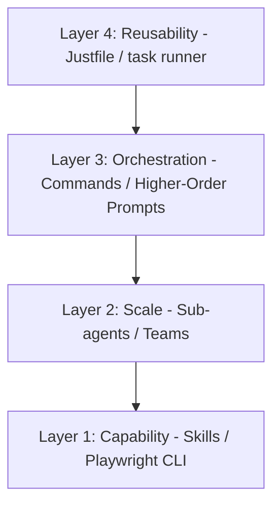

# Summary: My 4-Layer Claude Code Playwright CLI Skill (Agentic Browser Automation)

This document provides a structured summary of IndyDevDan's video: **"My 4-Layer Claude Code Playwright CLI Skill (Agentic Browser Automation)"**. It covers the design philosophy, the **Bowser** repository architecture, and how to build reusable, multi-layered agentic workflows for browser automation and UI testing.

---

## 💡 Core Philosophy: Agentic Engineering vs. Vibe Coding

Dan highlights a critical shift in how developers should approach building with AI:
* **Don't Outsource Learning**: Avoid blindly relying on pre-built plugins or rigid MCP servers. Agentic engineers understand exactly what their agents are doing, whereas "vibe coders" dump raw prompts and hope for the best.
* **Solve Classes of Problems**: Instead of creating one-off, fragile scripts for every automation task, template your engineering into **repeatable, opinionated solutions** that can be reused and specialized.
* **Prefer CLIs over MCP Servers**: MCP servers can be token-inefficient, rigid, and hard to customize. Standard CLI tools (like Playwright CLI wrapper scripts) allow the agent to run tasks cleanly, efficiently, and in parallel.

---

## 🏗️ The 4-Layer Architecture (Bowser)

Dan structures browser automation and testing into four distinct layers, stacked from low-level capabilities to high-level execution:

### 1. Capability (Skills)
* **What it is**: The base layer containing low-level tools that give your agent the capability to interact with the environment.
* **Implementation**:
  * **Playwright Browser Skill**: A token-efficient, headless CLI wrapper around Playwright. It supports parallel browser sessions and named session profiles (for stored states/cookies).
  * **Claude Browser Skill**: Leverages Claude Code's native `--chrome` flag, allowing Claude to interface directly with an open Chrome session (useful for authenticated state/personal browsing).
* **Key Benefit**: Provides raw browser access without the bloat of rigid MCP servers.

### 2. Scale (Sub-Agents / Teams)
* **What it is**: Orchestrates multiple sub-agents concurrently, each executing specific tasks and reporting back.
* **Implementation**:
  * **Bowser QA Agent**: Parses user stories into steps, runs them, takes screenshots of every step, and returns a pass/fail summary.
  * Spawning multiple browser agents in parallel dramatically speeds up UI validation compared to single-agent execution.

### 3. Orchestration (Commands / Higher-Order Prompts)
* **What it is**: Reusable slash commands or prompts that direct sub-agent workflows.
* **Implementation**:
  * **Higher-Order Prompts (HOPs)**: Prompts that behave like functions accepting other prompts as parameters. They establish a consistent wrapper flow (e.g., "Set up environment, execute the user's specific workflow, clean up, capture screenshots, and summarize").
  * **User Stories (`AI review` directory)**: Simple files defining the name, target URL, and exact steps to test. The orchestrator spawns agents for each story file.

### 4. Reusability (Task Runner / Justfiles)
* **What it is**: The top-level entry point that allows human developers and agents to run complex automation workflows with a single, short command.
* **Implementation**:
  * Dan uses **`just`** (a task runner) aliased to `J` in the terminal.
  * A `justfile` in the project root defines all workflow permutations and accepts overrides (e.g., `just test-chrome-skill` or `just automate-amazon`).
* **Key Benefit**: Standardizes how team members (and agents themselves) trigger tasks.

---

## 🚀 Showcased Workflows

### 🛒 Amazon Browser Automation (`just automate-amazon`)
* **Objective**: Automate a personal shopping workflow using the Claude `--chrome` flag.
* **How it works**: Uses an existing Chrome session (preserving log-in status), navigates to Amazon, and adds specified items (flowers, blue-light glasses) to the cart.
* **Safety & Reliability**: Demonstrates high prompt-adherence by stopping right at the final payment screen without placing the order.

### 🧪 Parallel UI QA Testing (`just UI-review`)
* **Objective**: Conduct parallel user-story testing against Hacker News.
* **How it works**:
  1. The orchestrator reads defined user story files.
  2. Spawns three headless Playwright sub-agents in parallel.
  3. Each agent operates on the web interface like a real user, navigating posts and checking comments.
  4. Takes a screenshot at every step (saving to a `/screenshots` folder).
  5. If a workflow fails, developers have a visual audit trail.
  6. Sub-agents merge their results and report a final execution summary back to the main agent.

---

## 🛠️ Key Takeaways for Vendoring

When porting these concepts to a custom skill-set (like `boss-skills`), keep these patterns in mind:
1. **CLI Wrappers**: Package browser actions into clean CLI commands rather than MCP endpoints.
2. **Screenshot Trails**: Ensure the browser skill outputs screenshots at each step. This gives the agent a feedback loop and the developer a visual debug trail.
3. **Task Standardization**: Use a `justfile` or a similar task runner to make agent runs predictable and easily configurable.
