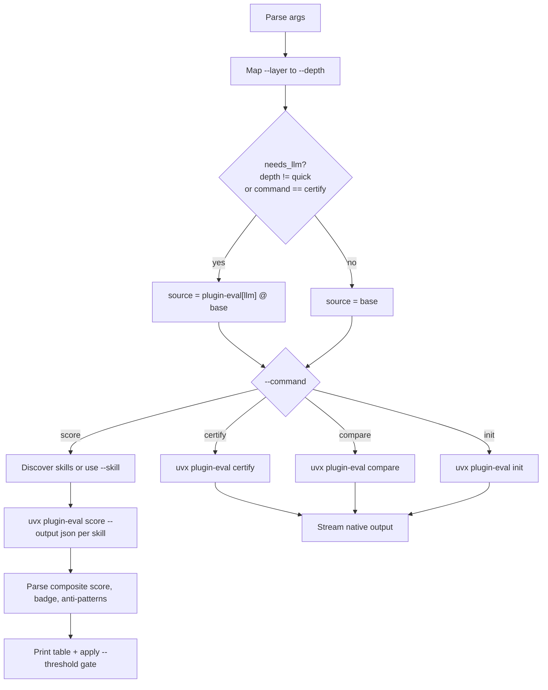

# eval-skills.py

Quality-gate the repository's Claude Code skills with
[`plugin-eval`](https://github.com/wshobson/agents/tree/main/plugins/plugin-eval).

`scripts/eval-skills.py` is a multi-mode CLI wrapper. It discovers the skills
in this repo, runs `plugin-eval` against them, prints a score table, and can
fail a build when a skill drops below a quality threshold.

## Overview

`plugin-eval` is **not vendored**. On each run the script pulls it on demand
with `uvx --from git+https://github.com/wshobson/agents.git#subdirectory=plugins/plugin-eval`,
so you always evaluate against the latest upstream rubric. The first run for a
given revision downloads and caches it; later runs reuse the `uv` cache.

The script exposes four `plugin-eval` subcommands through a single `--command`
flag:

| Command   | Purpose                                                            |
|-----------|--------------------------------------------------------------------|
| `score`   | Default. Discover (or target one) skill, score it, gate on a threshold. |
| `certify` | Run upstream's full certification report for one skill.            |
| `compare` | Diff two skills side by side.                                      |
| `init`    | Build a corpus index from a directory of plugins.                  |

`score` is the mode the script adds the most value to: it discovers every
skill, parses `plugin-eval`'s JSON into an aligned table, and applies a
threshold gate. `certify`, `compare`, and `init` stream `plugin-eval`'s native
output unchanged.

## Prerequisites

- **`uv` / `uvx` on `PATH`.** The script shells out to `uvx`; nothing else is
  installed locally.
- **Network access on first use.** `uvx` fetches `plugin-eval` from GitHub.
- **An LLM-backed environment for non-static layers.** The `static` layer is
  deterministic and offline. The `llm-judge`, `monte-carlo`, and `all` layers —
  and the `certify` command — pull `plugin-eval` with its `[llm]` extra and
  evaluate through Claude Code Max via `claude-agent-sdk`. Run these locally
  where that environment is available; CI uses `static` only.

## Quick start

```text
./scripts/eval-skills.py        # score every skill, static depth, never fails
make eval                       # same thing, via the Makefile
```

## Commands

| `--command` | Targets         | `--layer` honored | Output                          |
|-------------|-----------------|-------------------|---------------------------------|
| `score`     | none (discover) or `--skill` | yes  | Parsed score table + PASS/FAIL  |
| `certify`   | exactly 1 dir   | no — always deep upstream | Streamed markdown report |
| `compare`   | exactly 2 dirs  | yes               | Streamed markdown diff          |
| `init`      | exactly 1 dir   | no                | Streamed corpus-index progress  |

`score` never takes positional `targets` — point it at a single skill with
`--skill`. `certify`, `compare`, and `init` use positional `targets` and ignore
`--skill`.

## Options

| Option         | Type / choices                                              | Default  | Applies to            |
|----------------|-------------------------------------------------------------|----------|-----------------------|
| `--command`    | `score`, `certify`, `compare`, `init`                       | `score`  | all                   |
| `--layer`      | `static`, `static-analysis`, `llm-judge`, `monte-carlo`, `all` | `static` | `score`, `compare`    |
| `--threshold`  | float                                                       | none     | `score`, `certify`    |
| `--skill`      | path to one skill directory                                 | none     | `score` only          |
| `--corpus-dir` | path                                                        | upstream default | `init` only   |
| `targets`      | positional path(s)                                          | none     | `certify`/`compare`/`init` |

Notes:

- `--threshold` with no value means **report only** — the script always exits
  `0`. Supplying a value turns `score` into a gate (exit `1` on any failure)
  and is forwarded to `certify` as its pass mark.
- `--skill` accepts a path relative to the repo root or an absolute path. The
  script verifies a `SKILL.md` exists there before running.
- `--layer` is ignored by `certify` (upstream always certifies at deep depth)
  and by `init`.

## Evaluation layers

`--layer` is a friendly alias for `plugin-eval`'s `--depth`:

| `--layer`                 | `--depth`  | Layers run                       | Cost                  |
|---------------------------|------------|----------------------------------|-----------------------|
| `static`, `static-analysis` | `quick`  | static                           | instant, free, offline |
| `llm-judge`               | `standard` | static + judge                   | ~30s, 4 LLM calls     |
| `monte-carlo`             | `deep`     | static + judge + MC (50 samples) | ~2–5 min              |
| `all`                     | `thorough` | static + judge + MC (100 samples) | slowest              |

`static` is the default and the only layer that needs no LLM access — it is
what CI runs. Use the deeper layers locally when you want a judged or
statistical read on a specific skill.

## Exit codes

| Code | Meaning                                                                 |
|------|-------------------------------------------------------------------------|
| `0`  | Success. For `score`: all skills met the threshold, or no threshold set. |
| `1`  | `score` gate failed — a skill scored below `--threshold` or errored; or a streamed subcommand returned non-zero. |
| `2`  | Usage error — bad `--skill` path, wrong number of `targets`, or no skills found under `plugins/`. |

## Environment variables

| Variable             | Purpose                                                          |
|----------------------|------------------------------------------------------------------|
| `PLUGIN_EVAL_SOURCE` | Override the `uvx --from` source. Use to pin a revision when upstream churns, without editing the script. |

```text
PLUGIN_EVAL_SOURCE='git+https://github.com/wshobson/agents.git@<sha>#subdirectory=plugins/plugin-eval' \
  ./scripts/eval-skills.py
```

When a non-static layer or `certify` needs the `[llm]` extra, the script wraps
a bare git/path source as `plugin-eval[llm] @ <source>`. If you set
`PLUGIN_EVAL_SOURCE` to a value that already starts with `plugin-eval` (a full
PEP 508 spec), it is used as-is and never double-wrapped.

## How it works

The script parses arguments, maps `--layer` to a `plugin-eval` depth, decides
whether the LLM extra is needed, then dispatches to one `uvx` invocation.



For `score`, skill discovery globs `plugins/**/SKILL.md` and uses each match's
parent directory. Skills under `.claude/skills/` are **not** discovered — only
the `plugins/` tree is scored. Each skill is evaluated with
`--output json`; the script reads `composite.score`, `composite.badge`, and
sums `anti_patterns` across layers into the table.

## Example invocations

All paths below exist in this repository today.

### Score every skill

```text
# Report all skills, static depth — always exits 0
./scripts/eval-skills.py
```

Sample output:

```text
SKILL                                                          SCORE  BADGE      ANTI  STATUS
-----------------------------------------------------------------------------------------------
plugins/boss-homelab/proxmox-infra/skills/proxmox-infrastructure   62.3  bronze        2  ok
plugins/social-media/twitter-tools/skills/twitter-media-downloader  73.7  silver     0  ok
plugins/social-media/twitter-tools/skills/twitter-to-reel        66.5  bronze        1  ok
```

(Scores and badges are illustrative — they reflect the 2026-05-19 baseline
recorded in the `Makefile`.)

### Gate on a threshold

```text
# Exit 1 if any skill scores below 57 (the repo's CI floor)
./scripts/eval-skills.py --threshold 57
```

When every skill passes, the script prints a `PASS:` footer; otherwise it
prints a `FAIL:` line naming the count below threshold and exits `1`.

### Score one skill

```text
./scripts/eval-skills.py --skill plugins/social-media/twitter-tools/skills/twitter-to-reel
```

### Deeper layers on a single skill

```text
# LLM judge layer (~30s, needs LLM access)
./scripts/eval-skills.py \
  --skill plugins/boss-homelab/proxmox-infra/skills/proxmox-infrastructure \
  --layer llm-judge

# Monte-carlo layer (~2-5 min)
./scripts/eval-skills.py \
  --skill plugins/social-media/twitter-tools/skills/twitter-media-downloader \
  --layer monte-carlo

# Thorough layer across all skills, gated at 60
./scripts/eval-skills.py --layer all --threshold 60
```

### Certify one skill

```text
# Always deep upstream; --layer is ignored
./scripts/eval-skills.py --command certify plugins/boss-homelab/proxmox-infra/skills/proxmox-infrastructure

# Forward a pass mark to the certification
./scripts/eval-skills.py --command certify \
  plugins/boss-homelab/proxmox-infra/skills/proxmox-infrastructure --threshold 70
```

### Compare two skills

```text
./scripts/eval-skills.py --command compare \
  plugins/social-media/twitter-tools/skills/twitter-media-downloader \
  plugins/social-media/twitter-tools/skills/twitter-to-reel
```

### Build a corpus index

```text
./scripts/eval-skills.py --command init plugins/
./scripts/eval-skills.py --command init plugins/ --corpus-dir .plugin-eval-corpus
```

### Pin a specific upstream revision

```text
PLUGIN_EVAL_SOURCE='git+https://github.com/wshobson/agents.git@<sha>#subdirectory=plugins/plugin-eval' \
  ./scripts/eval-skills.py
```

## Makefile integration

Three targets wrap the script:

| Target            | Command                                              | Use                                |
|-------------------|------------------------------------------------------|------------------------------------|
| `make eval`       | `./scripts/eval-skills.py`                           | Report all skills, static depth, never fails. |
| `make eval-ci`    | `./scripts/eval-skills.py --threshold $(EVAL_THRESHOLD)` | Quality gate.                  |
| `make eval-skill` | `plugin-eval score "$(SKILL)" --depth standard` (direct `uvx`) | Deep-dive one skill at standard depth. |

```text
make eval
make eval-ci
make eval-skill SKILL=plugins/social-media/twitter-tools/skills/twitter-to-reel
```

`EVAL_THRESHOLD` defaults to `57` — set as `min(observed baseline) - 5` as a
safety margin, and never lowered below `57`. The 2026-05-20 baseline (12 skills,
static depth) had its lowest scores at fetch-unresolved-comments 60.9 and
fetch-diff 61.3, so `min(observed) - 5` is 55.9 and the floor stays at `57`.
Re-baseline with `make eval` and raise `EVAL_THRESHOLD` when skills genuinely
improve.

Override the threshold ad hoc:

```text
make eval-ci EVAL_THRESHOLD=60
```

## CI integration

`.github/workflows/ci.yml` runs `make eval-ci` as a dedicated step. It runs at
`static` depth only — deterministic, no LLM, no secrets — and only on the
Python 3.13 matrix entry so it executes once per build. The deeper,
LLM-backed layers are intended for local use.

## Troubleshooting

| Symptom                                   | Cause / fix                                                            |
|--------------------------------------------|------------------------------------------------------------------------|
| `uvx: command not found`                   | Install `uv` (which provides `uvx`) and ensure it is on `PATH`.        |
| First run hangs or fails to download       | `uvx` needs network access to fetch `plugin-eval`. Check connectivity, or pin a cached revision via `PLUGIN_EVAL_SOURCE`. |
| `No skills found under plugins/.`           | Run from the repo root; the script globs `plugins/**/SKILL.md`. Skills under `.claude/skills/` are intentionally not scored. |
| `error: no SKILL.md in <path>`              | `--skill` must point at the directory that contains `SKILL.md`, not a parent or the file itself. |
| `ERROR: unparsable plugin-eval output`      | Upstream output changed. Pin a known-good revision with `PLUGIN_EVAL_SOURCE`. |
| LLM layers fail with an auth/SDK error      | `llm-judge`, `monte-carlo`, `all`, and `certify` need Claude Code Max via `claude-agent-sdk`. Run them in an environment where that is configured, or stick to `static`. |

## See also

- [`docs/scripts.md`](scripts.md) — index of all `scripts/` tooling.
- [`plugin-eval` upstream](https://github.com/wshobson/agents/tree/main/plugins/plugin-eval).
