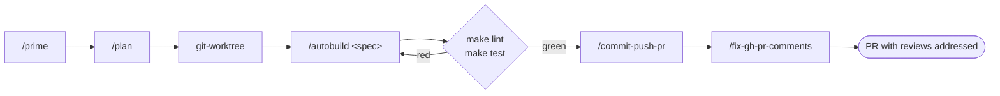
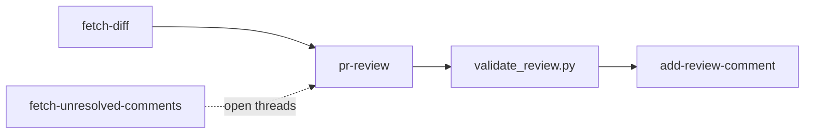

# agent-harness

> `boss-dev` · v0.31.3 · [plugin source](../../plugins/boss-dev/agent-harness/)

Agent harness tooling for Claude Code: subagents, commands, hooks, skills, and scripts that
build and operate agentic dev workflows. The plugin ships three families of skills — a
GitHub PR-review workflow, a git-worktree lifecycle, and a release-notes generator —
alongside planning, priming, and shipping commands, a roster of subagents, and a library of
lifecycle hooks, output styles, and status lines.

## Installation

```bash
/plugin marketplace add bossjones/boss-skills   # once
/plugin install agent-harness@boss-skills
```

## What's inside

| Component | Count | Active on install? |
|-----------|-------|--------------------|
| Skills | 14 | Yes |
| Commands | 13 | Yes |
| Agents | 6 | Yes |
| Output styles | 8 | Yes |
| Hooks | 20 events | Yes |
| Status lines | 10 | Manual wiring |

## Skills

Skills live under `skills/<name>/SKILL.md`. The PR-review skills carry standalone
PEP 723 scripts run with `uv run`; `uv` resolves their dependencies on demand, so they work
immediately after install with no extra setup. The families below are representative; see the
plugin's [docs/skills.md](../../plugins/boss-dev/agent-harness/docs/skills.md) for the complete,
current list.

### PR review workflow

Adapted from the [mlflow](https://github.com/mlflow/mlflow) skills (Apache-2.0).

| Skill | Description |
|-------|-------------|
| `fetch-diff` | Fetch a GitHub PR diff with old/new line numbers and auto-generated-file masking, optionally filtered to file globs. |
| `fetch-unresolved-comments` | Fetch only the unresolved PR review threads via the GitHub GraphQL API, grouped by file. |
| `pr-review` | Review a PR and emit a schema-validated local review payload — inline comments plus an approve-or-comment decision. |
| `add-review-comment` | Post a single inline review comment to a PR line or line range via the GitHub API. |

### Git worktree lifecycle

Adapted from [claude-code-ultimate-guide](https://github.com/FlorianBruniaux/claude-code-ultimate-guide) (MIT).

| Skill | Description |
|-------|-------------|
| `git-worktree` | Create an isolated worktree for feature development with branch naming, dependency symlinking, and background verification. |
| `git-worktree-status` | Report background type-check, test, and build status for a worktree. |
| `git-worktree-remove` | Safely remove one worktree with branch cleanup and safety checks. |
| `git-worktree-clean` | Batch-clean stale and merged worktrees with a disk-usage report. |

### Release notes

| Skill | Description |
|-------|-------------|
| `release-notes-generator` | Generate release notes in three formats (CHANGELOG.md, PR body, Slack announcement) from git commits. |

### Machine setup

| Skill | Description |
|-------|-------------|
| `setup-second-brain` | Install/configure the obsidian-wiki uv tool plus optional [QMD](https://github.com/tobi/qmd) semantic search (detect → preview → apply, with backups and a `--dry-run` diff). Needs `node` ≥ 22 for the optional QMD step. |

Walk through it end to end in the [Set up your second brain](../tutorials/agent-harness/second-brain.md)
tutorial.

## Commands

Twelve slash commands, namespaced `/agent-harness:<command>`.

| Command | Description |
|---------|-------------|
| `/agent-harness:prime` | Load context for a new session by analyzing codebase structure, docs, and README. |
| `/agent-harness:question` | Answer questions about project structure and docs without making code changes. |
| `/agent-harness:plan` | Create a concise engineering implementation plan from a prompt and save it to the specs directory. |
| `/agent-harness:plan_w_team` | Same as `plan`, with team orchestration (opus model and builder/validator task assignments). |
| `/agent-harness:build` | Implement an existing plan file, then report the completed work. |
| `/agent-harness:autobuild` | Implement a spec inside a linked git worktree, then verify, commit, push, open a PR, and address reviews (opus). |
| `/agent-harness:commit-push-pr` | Stage specific files, write a conventional commit, push, and open or reuse a GitHub PR. |
| `/agent-harness:fix-gh-pr-comments` | Triage unresolved PR review comments, apply fixes, push, reply to and resolve each thread, and poll for new ones (≤ 3 cycles). |
| `/agent-harness:debug-ci` | Diagnose a failed GitHub Actions run, fix locally, push, and poll the new run until green (≤ 3 cycles). |
| `/agent-harness:update_status_line` | Upsert a key/value pair into a session's status-line data file. |
| `/agent-harness:all_tools` | List every tool in the system prompt as TypeScript signatures with each tool's purpose. |
| `/agent-harness:sentient` | Demo command showing a hook blocking a dangerous `rm -rf`. |

## Agents

Subagents are dispatched via the `Agent`/`Task` tool — by name, or proactively by Claude.

| Agent | Description |
|-------|-------------|
| `meta-agent` | Generate a complete Claude Code subagent definition from a plain-language description. |
| `llm-ai-agents-and-eng-research` | AI research specialist that gathers the latest LLM, agent, and engineering developments. |
| `work-completion-summary` | Produce a concise audio summary when work completes (triggered by "tts summary"). |
| `hello-world-agent` | Simple greeting agent (triggered by "hi claude"). |
| `team/builder` | Generic engineering agent that executes one task at a time; runs ruff + ty hooks after edits. |
| `team/validator` | Read-only agent that verifies a builder's task met its acceptance criteria. |

## Workflows

### Feature loop: plan → worktree → build → ship



### PR review chain



## Usage examples

### Plan, then build a feature

```text
/agent-harness:prime
/agent-harness:plan add a --json flag to the download script
/agent-harness:build specs/add-json-flag.md
```

`prime` loads project context, `plan` writes a spec to the specs directory, and `build`
implements that spec and reports back.

### Implement a spec end-to-end in a worktree

```text
cd <repo-root> && export PREFIX="spec-"
claude --worktree "${PREFIX}add-json-flag"
# then inside the new session:
/agent-harness:autobuild specs/add-json-flag.md
```

`autobuild` hard-stops if it isn't inside a linked worktree, implements the spec, gates on
`make lint` / `make test`, then chains `commit-push-pr` and `fix-gh-pr-comments` to open a
PR and respond to review comments.

### Review a pull request

The PR-review skills chain together. Ask Claude in natural language:

```text
Review PR #142 in this repo and draft inline comments.
```

Claude runs `fetch-diff` to get the annotated diff, `pr-review` to produce a
schema-validated review payload locally, then `add-review-comment` to post individual
comments. You can also run the bundled scripts directly:

```bash
uv run "${CLAUDE_SKILL_DIR}/scripts/fetch_diff.py" --help
```

### Address only open review feedback

```text
What review comments on PR #142 still need a response?
```

The `fetch-unresolved-comments` skill queries the GitHub GraphQL API and returns only the
threads that have not been resolved, grouped by file. To go further and actually apply fixes, reply
to each thread, and resolve it, run `/agent-harness:fix-gh-pr-comments 142`.

### Fix a failing CI run

```text
/agent-harness:debug-ci
```

`debug-ci` finds the latest failed GitHub Actions run on the current branch, categorizes the
failure (lint, type, tests, lockfile, docs…), fixes it locally, pushes, and polls the new
run until it goes green — up to three cycles.

### Scaffold a new subagent

```text
Use the meta-agent to create a subagent that audits Dockerfiles for security issues.
```

`meta-agent` researches the current subagent format and writes a complete
`agents/<name>.md` definition.

### Generate release notes

```text
Generate release notes for the commits since v0.1.0.
```

`release-notes-generator` categorizes the commits and emits a `CHANGELOG.md` section, a PR
body, and a Slack announcement.

## Hooks and status lines

All 20 hook events are enabled on install through `hooks/hooks.json`; they use a universal,
fail-open logger that appends redacted JSONL records at
`.{plugin-repo}/logs/<session>/<Event>.jsonl`. The same project-local root contains live session
`data/` and regenerable `cache/`. `MessageDisplay` is intentionally deferred pending a measured
logger cold-start p95 and is not enabled. See the
[hooks reference](../../plugins/boss-dev/agent-harness/docs/hooks.md) for the event list,
retention, configuration, and deferred-event decisions.

Status lines remain opt-in: set `statusLine` to a script under `status_lines/`. Status lines and
`/agent-harness:update_status_line` read session state from
`.{plugin-repo}/data/sessions/<session>.json`.

## See also

- Plugin source: [`plugins/boss-dev/agent-harness/`](../../plugins/boss-dev/agent-harness/)
- Plugin README: [`plugins/boss-dev/agent-harness/README.md`](../../plugins/boss-dev/agent-harness/README.md)
