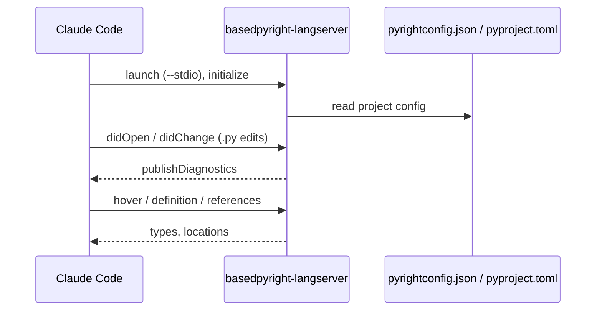

# basedpyright-lsp

> `boss-dev` · v0.1.1 · [plugin source](../../plugins/boss-dev/basedpyright-lsp/)

LSP plugin that wires [basedpyright](https://docs.basedpyright.com/) into Claude Code, giving
Claude real-time Python diagnostics, hover docs, go-to-definition, and find-references while
editing Python code. It is a thin configuration shim — a single `.lsp.json` that delegates all
analysis to the `basedpyright-langserver` binary, which you install separately.

## Installation

```bash
# 1. Install the language server (once, on your machine)
uv tool install basedpyright          # or: pip install basedpyright
basedpyright-langserver --help        # verify it is on PATH

# 2. Register the marketplace and install the plugin
/plugin marketplace add bossjones/boss-skills
/plugin install basedpyright-lsp@boss-skills
```

Restart Claude Code (or run `/reload-plugins`) so the LSP server attaches. Requires
**Claude Code 2.1.50+**.

## Capabilities

For `.py`, `.pyi`, and `.pyw` files, the language server gives Claude:

| Capability | What you get |
|------------|--------------|
| Real-time diagnostics | Type errors and lint findings as you edit, in the `/plugin` Errors tab. |
| Hover documentation | Inferred types and docstrings on hover. |
| Go-to-definition | Jump to a symbol's definition. |
| Find references | Locate every usage of a symbol. |
| Semantic tokens | Full semantic highlighting (removed from upstream pyright). |
| Inlay hints | Inline type annotations for inferred values. |
| Baseline files | Suppress pre-existing findings so only new issues surface. |

## Why basedpyright (not pyright)?

| Aspect | pyright | basedpyright |
|--------|---------|--------------|
| Check coverage | Baseline | Strict superset (plus rules like `reportImplicitOverride`) |
| LSP surface | Trimmed by Microsoft | Re-adds semantic tokens, inlay hints, baseline files |
| Configuration | `pyrightconfig.json`, `[tool.pyright]` | Reads the same files, plus `[tool.basedpyright]` |
| Distribution | Node toolchain | Single binary installable via `uv` |

Anthropic's official marketplace already provides `pyright-lsp`. This plugin exists to cover
basedpyright users specifically; install `pyright-lsp` instead if you want vanilla pyright.

## How it works

Claude Code spawns `basedpyright-langserver` once per session and exchanges LSP messages with it
over stdio. The server reads your project's pyright/basedpyright configuration to decide how
strict to be.



### `.lsp.json` reference

| Key | Value | Purpose |
|-----|-------|---------|
| `command` | `basedpyright-langserver` | Executable Claude Code launches. |
| `args` | `["--stdio"]` | Communicate over stdin/stdout. |
| `transport` | `stdio` | Transport mechanism. |
| `extensionToLanguage` | `.py`, `.pyi`, `.pyw` → `python` | Extensions mapped to the `python` language ID. |
| `initializationOptions` | `{}` | None — server uses project config. |
| `settings` | `{}` | None — server uses project config. |
| `maxRestarts` | `3` | Restart up to three times if the server crashes. |

## Configuration

The plugin ships no strictness opinions. Configure basedpyright per-project the same way you'd
configure pyright — via `pyrightconfig.json` at the project root, or `[tool.basedpyright]`
(or `[tool.pyright]`) in `pyproject.toml`:

```toml
[tool.basedpyright]
include = ["src"]
pythonVersion = "3.13"
typeCheckingMode = "strict"
reportImplicitOverride = "error"
```

See the [basedpyright configuration docs](https://docs.basedpyright.com/latest/configuration/config-files/)
for the full option list.

## Verification

1. Open any `.py` file in a project that uses basedpyright.
2. Run `/plugin` and confirm the Errors tab is clean for `basedpyright-lsp`.
3. Introduce an obvious type error (`x: int = "string"`) and confirm Claude sees a diagnostic.

## Troubleshooting

| Symptom | Cause | Fix |
|---------|-------|-----|
| `Executable not found in $PATH` | basedpyright not installed for Claude Code's shell. | `uv tool install basedpyright`; confirm with `which basedpyright-langserver`. |
| LSP doesn't attach | Claude Code older than 2.1.50. | Upgrade to 2.1.50+ (or `npx tweakcc --apply` once on older builds). |
| No diagnostics surface | No config, or file has no project root. | Add a config (or remove all to use defaults); open the file within a project root. |

## See also

- Plugin source: [`plugins/boss-dev/basedpyright-lsp/`](../../plugins/boss-dev/basedpyright-lsp/)
- Plugin README: [`plugins/boss-dev/basedpyright-lsp/README.md`](../../plugins/boss-dev/basedpyright-lsp/README.md)
