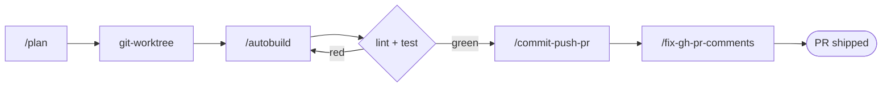

# Tutorial: Ship a feature with the agent-harness loop

`agent-harness` chains its planning and shipping commands into a single isolated feature loop:
**plan → worktree → build → commit/PR → address review**. This walkthrough runs that loop once, from
a written plan to a pull request that responds to review comments.

**Time:** ~15 minutes · **Level:** intermediate · **Reference:** [agent-harness.md](../../plugins/agent-harness.md)

## Prerequisites

| You need | Check it |
|----------|----------|
| The plugin installed | `/plugin install agent-harness@boss-skills` |
| `git` + `gh` CLI authenticated | `gh auth status` |
| A repo you can branch and open PRs in | any working git repo |

## Step 1 — Prime the session

Load project context so the agent understands the codebase before planning:

```text
/agent-harness:prime
```

## Step 2 — Write a plan

Describe the change; the command produces a concise implementation plan saved under `specs/`:

```text
/agent-harness:plan add a --json flag to the download script
```

Review the generated `specs/*.md` before continuing — the rest of the loop executes it.

## Step 3 — Work in an isolated worktree

The build step is designed to run inside a dedicated git worktree so the work is isolated from your
main checkout. The plugin ships git-worktree skills for this lifecycle (create, status, clean,
remove). Create one for the feature, then run the build there:

```text
Create a git worktree for this feature.
```

## Step 4 — Autobuild

Point `autobuild` at the spec from Step 2. It implements the plan, then loops on lint + test until
green:

```text
/agent-harness:autobuild specs/add-json-flag.md
```



## Step 5 — Commit, push, open the PR

Once the branch is green, package it into a reviewable PR with a conventional-commit message:

```text
/agent-harness:commit-push-pr
```

## Step 6 — Address review comments

After reviewers (human or bot) leave unresolved comments, pull them in, apply fixes, push, and reply
per-thread — up to three cycles:

```text
/agent-harness:fix-gh-pr-comments
```

## What you get

A feature implemented from a written spec in an isolated worktree, validated by lint + test, shipped
as a conventional-commit PR, with review feedback addressed — without leaving Claude Code.

## Beyond the loop

`agent-harness` bundles more than the feature loop — a PR-review skill family, worktree-lifecycle
skills, a release-notes generator, output styles, status lines, and lifecycle hooks. See the
[reference page](../../plugins/agent-harness.md) for the full component roster and the manual-wiring
notes for hooks and status lines.

## Next steps

- Reference: [`docs/plugins/agent-harness.md`](../../plugins/agent-harness.md)
- Plugin README: [`plugins/boss-dev/agent-harness/README.md`](../../../plugins/boss-dev/agent-harness/README.md)
- Back to all [tutorials](../README.md)
