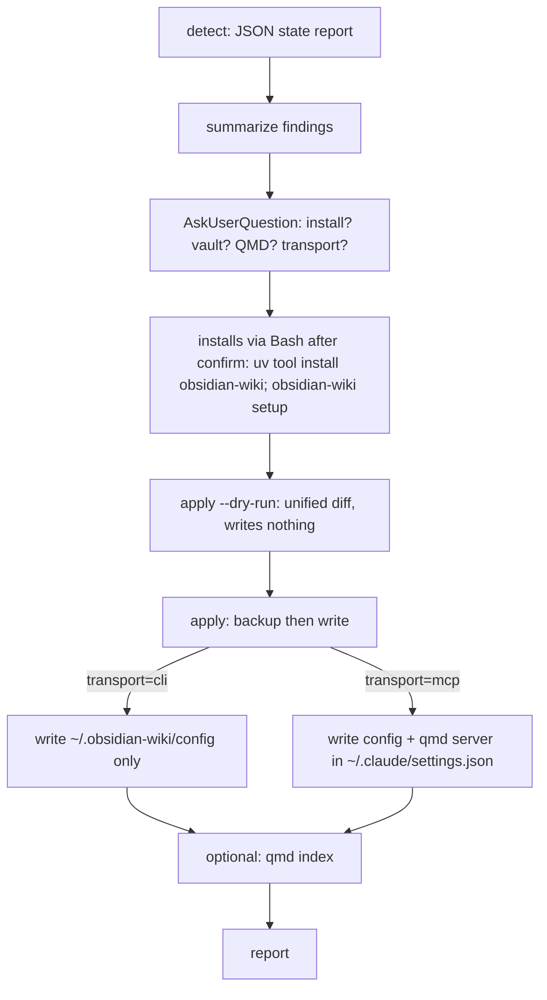
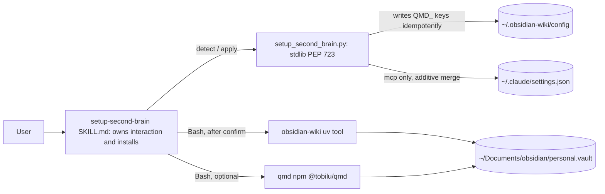

# Tutorial: Set up your second brain (obsidian-wiki + optional QMD)

The `setup-second-brain` skill bootstraps a "second brain" on your machine: it installs
[`obsidian-wiki`](https://github.com/ar9av/obsidian-wiki) (a global `uv` tool that maintains an
Obsidian markdown knowledge vault) and, optionally, [QMD](https://github.com/tobi/qmd) on-device
semantic search. This walkthrough runs it once, from nothing installed to a working vault — and shows
exactly what it asks and what it writes.

**Time:** ~10 minutes · **Level:** beginner · **Reference:** [agent-harness.md](../../plugins/agent-harness.md)

## Prerequisites

| You need | Check it |
|----------|----------|
| The plugin installed | `/plugin install agent-harness@boss-skills` |
| `uv` on PATH | `uv --version` |
| (Optional, for QMD) Node ≥ 22 + npm | `node --version` |

QMD is entirely optional: if Node is older than 22 or you decline it, you still get a fully working
obsidian-wiki vault — the wiki skills just fall back to Grep instead of semantic search.

## Step 1 — Invoke the skill

It is explicit-invocation (`disable-model-invocation: true`), so ask for it by name or run the
command. Start with a preview:

```text
/agent-harness:setup-second-brain --dry-run
```

The skill owns all interaction: it detects your machine's state, asks a few questions, previews every
change as a diff, and only then installs or writes anything.

## Step 2 — Detect (read-only)

First it runs the stdlib script in `detect` mode and prints a JSON state report. On a fresh machine
you'll see something like:

```text
$ uv run "${CLAUDE_SKILL_DIR}/scripts/setup_second_brain.py" detect
```

- `config_exists: false` — no `~/.obsidian-wiki/config` yet.
- `env.obsidian_wiki.installed: false` — the tool isn't installed.
- `env.node.meets_min: true` — Node ≥ 22 is present, so QMD is available.

Nothing is changed by `detect`; it only reads.

## Step 3 — Answer the prompts

The skill asks only for what `detect` left undecided:

- **Install obsidian-wiki?** — confirms `uv tool install "obsidian-wiki[graph,ast]"`.
- **Vault path** — default `~/Documents/obsidian/personal.vault`. Keep it or point at another path.
- **Enable QMD?** — Yes / No. If Node is too old, it's skipped automatically.
- **QMD transport** — `cli` (default; no `settings.json` change) or `mcp` (adds a `qmd` MCP server to
  `~/.claude/settings.json`). For `cli`, also pick a search mode: `quality` (default), `balanced`, or
  `fast`.
- **Index the vault now?** — build the QMD collection right after setup.

## Step 4 — Preview the config diff

Before writing, the skill runs `apply` with `--dry-run`, which writes nothing and returns a unified
diff per touched file:

```text
$ uv run "${CLAUDE_SKILL_DIR}/scripts/setup_second_brain.py" apply --qmd-config --transport cli --search-mode quality --dry-run
```

Review the `qmd_config.diff` (and `mcp.diff` if you chose `mcp` transport). A `changed: false` result
means that file is already in the desired state.

## Step 5 — Apply

Drop `--dry-run` to write. Each file is backed up first to `<file>.backup.<timestamp>`, and the
skill reports the backup paths:

```text
$ uv run "${CLAUDE_SKILL_DIR}/scripts/setup_second_brain.py" apply --qmd-config --transport cli --search-mode quality
```

For `cli` transport only `~/.obsidian-wiki/config` is touched. `mcp` transport additionally merges a
`qmd` server into `~/.claude/settings.json` (additive — your other MCP servers are preserved), and
Claude Code must reload to pick it up.

## Step 6 — Index the vault (optional)

If you enabled QMD and chose to index, the skill builds the collection from your vault. Confirm the
exact subcommands with `qmd --help`, then:

```text
$ qmd collection add ~/Documents/obsidian/personal.vault --name wiki
$ qmd embed
```

Use the same collection name that was written to `QMD_WIKI_COLLECTION`.

## Step 7 — Verify

```text
$ obsidian-wiki info
```

Re-run `detect` to confirm the new state: `config_exists: true`, your `OBSIDIAN_VAULT_PATH`, and the
`QMD_*` keys you chose. From here the wiki skills (`wiki-ingest`, `wiki-query`, and friends) activate
automatically — with QMD they use semantic search, without it they use Grep.

## How it works

The skill owns installs and interaction; the deterministic, idempotent, offline file edits live in a
stdlib-only PEP 723 script. The workflow:



Who writes what:



## Troubleshooting

| Symptom | Cause | What happens / fix |
|---------|-------|--------------------|
| QMD step skipped | Node older than 22, or you declined it | Expected — obsidian-wiki still works with Grep. Install Node ≥ 22 (`fnm use 22`) and re-run to add QMD later. |
| `mcp` apply reports an error and writes nothing | `~/.claude/settings.json` contains invalid JSON | The script validates `settings.json` first and aborts before touching the config — fix or remove the file, then re-run. |
| Second run shows no diff | Config already matches your choices | The write is idempotent — no diff and no new backup is expected. |
| `settings_error` in `detect`, `mcp_qmd_configured: null` | `settings.json` is unreadable | `cli` transport is unaffected; fix the file before choosing `mcp`. |

## Reference

For the full CLI flags, the `~/.obsidian-wiki/config` schema, and the `OBSIDIAN_*`/`QMD_*` environment
variables, see the [`setup-second-brain` skill reference](../../../plugins/boss-dev/agent-harness/docs/skills.md#setup-second-brain)
and the [second brain environment section](../../../plugins/boss-dev/agent-harness/docs/getting-started.md#second-brain-obsidian-wiki-environment).
