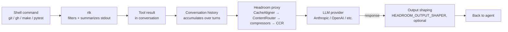

# Tutorial: Stack Headroom on top of rtk for two-layer token reduction

**Time:** ~25 minutes · **Level:** intermediate · **Reference:** [Headroom docs](https://docs.headroomlabs.ai/docs)

[Headroom](https://github.com/headroomlabs-ai/headroom) and [rtk](https://github.com/rtk-ai/rtk)
(Rust Token Killer — already installed on this machine) both exist to cut how many tokens your
agent sessions burn, but they sit at different layers of the stack. This tutorial wires up
Headroom next to the rtk hook you're likely already running, explains the one place they
genuinely overlap, and shows how to measure whether the combination is actually paying for itself
on a real repo.

## Why run two token-reduction tools

They don't compete for the same bytes:

- **rtk** sits between a shell command and the tool result. It rewrites `git status` → `rtk git
  status` transparently via a Claude Code hook, and shrinks the *stdout of that one command*
  before the tool result is ever constructed. Deterministic, local, no LLM involved.
- **Headroom** sits between the finished conversation and the LLM provider. It compresses the
  *whole outbound request* — every accumulated tool result, JSON payload, and log line, plus
  optionally the model's *output* — right before it crosses the wire.

| Layer | What it sees | Mechanism | Latency | Wins on |
|-------|--------------|-----------|---------|---------|
| rtk (shell) | One command's stdout, before the tool result exists | Deterministic filters/summarizers, no LLM | ~0ms–2s | `git`, `gh`, `make`, `pytest`, `ruff`, `grep`, `find`, `docker`, `kubectl`, … |
| Headroom (proxy) | The full outbound request (accumulated history) and, optionally, the model's output | CacheAligner → ContentRouter → compressors (SmartCrusher/CodeCompressor/Kompress) → CCR | proxy hop + compression pass | Large JSON tool results, structured logs, long agentic conversations, output-token shaping |

Because rtk never sees the conversation as a whole (only one command at a time), and Headroom
never intercepts a shell command directly (it only sees what already became part of the request),
they compose: rtk cuts the tool output at the source, and Headroom cuts what's left — file reads
via the `Read` tool, MCP responses, conversation-history accumulation, and model output that rtk
never touched.

There's one deliberate overlap to be aware of, covered in [Step 4](#step-4--decide-who-owns-shell-output-the---no-rtk-flag).

### The pipeline



Note that the `Read` tool, MCP responses, and conversation history never pass through a shell, so
rtk never sees them — that whole class of context is Headroom-only territory.

## Prerequisites

| You need | Check it |
|----------|----------|
| Headroom installed | `headroom --version` (this machine: `0.32.1`, drift from latest `0.33.0` — see [Step 1](#step-1--verify-and-upgrade-the-install)) |
| rtk installed and hooked into Claude Code | `rtk gain` succeeds — if it errors you may have the [name-collision binary](#troubleshooting) instead |
| `uv` on PATH (Headroom's install method) | `uv --version` |
| Python 3.10+ | `python3 --version` |
| Claude Code CLI | `claude --version` |
| A repo to test in | this tutorial uses `boss-skills` itself |

## Step 1 — Verify and upgrade the install

Headroom is installed via `uv tool` from PyPI ([`headroom-ai`](https://pypi.org/project/headroom-ai/)).
Check what's actually on this machine first:

```bash
headroom --version
```

```text
headroom, version 0.32.1
```

The latest release is [v0.33.0](https://github.com/headroomlabs-ai/headroom/releases/tag/v0.33.0)
(published 2026-07-29) — so this machine is one release behind. Update it:

```bash
headroom update
```

If you're installing fresh instead, the verified install command is:

```bash
uv tool install --python 3.13 "headroom-ai[all]"
```

Requires Python 3.10+; prebuilt wheels cover Linux (manylinux_2_28, x86_64/aarch64) and macOS
Apple Silicon. If `headroom` isn't on PATH afterward, run `uv tool update-shell`. Full details on
the [installation doc](https://docs.headroomlabs.ai/docs/installation) — there's also a
[Docker image](https://github.com/headroomlabs-ai/headroom/blob/main/docs/content/docs/docker-install.mdx)
(`ghcr.io/headroomlabs-ai/headroom:latest`) if you'd rather not install locally.

> **Note:** the npm package [`headroom-ai`](https://www.npmjs.com/package/headroom-ai) is the
> TypeScript **SDK** only — it does not ship the `headroom` CLI. Use `uv tool install` for the CLI
> regardless of what else you have installed via npm.

While you're here, check rtk too — it drifts the same way. On this machine `rtk --version` reports
`0.43.0` while Homebrew has `0.44.1`:

```bash
brew upgrade rtk
```

One privacy note before you route any traffic: Headroom runs entirely locally, and anonymous
telemetry is **off by default** (`HEADROOM_TELEMETRY=off`). rtk's telemetry is likewise off by
default — `rtk config` shows `[telemetry] enabled = false`. Neither tool phones home unless you opt
in.

## Step 2 — Establish the baseline with `headroom doctor`

Before wiring anything up, `headroom doctor` tells you honestly what's already working. Run it
now:

```bash
headroom doctor
```

On this machine, with Headroom installed but not yet wired into any project, this is the actual
output (verified 2026-08-03):

```text
Headroom Doctor v0.32.1 · port 8787

┏━━━━━━━━━━━━━┳━━━━━━━━┳━━━━━━━━━━━━━━━━━━━━━━━━━━━━━━━━━━━━━━━━━━━━━━━━━━━━━━━┓
┃ check       ┃ status ┃ summary                                               ┃
┡━━━━━━━━━━━━━╇━━━━━━━━╇━━━━━━━━━━━━━━━━━━━━━━━━━━━━━━━━━━━━━━━━━━━━━━━━━━━━━━━┩
│ proxy       │ ✗ fail │ not reachable at http://127.0.0.1:8787                │
│ version     │ · skip │ proxy not reachable                                   │
│ claude      │ ⚠ warn │ not routed (no ANTHROPIC_BASE_URL in settings env)    │
│ wrap_marker │ · skip │ no wrap marker found                                  │
│ codex       │ ⚠ warn │ not routed (no ~/.codex/config.toml)                  │
│ shell env   │ ⚠ warn │ points at https://api.anthropic.com, not the local    │
│             │        │ Headroom proxy (ANTHROPIC_BASE_URL)                   │
│ savings     │ ⚠ warn │ no savings recorded yet                               │
│ budget      │ · skip │ proxy not reachable                                   │
└─────────────┴────────┴───────────────────────────────────────────────────────┘
proxy: start it with: headroom proxy
claude: wrap it: headroom wrap claude
codex: wrap it: headroom wrap codex
savings: route a client through the proxy and make a request

1 failure(s), 4 warning(s)
```

That's the expected starting state: the binary is present, but nothing is routed through it yet,
and there's no savings history because no traffic has ever crossed the proxy. Note that `doctor`
also prints the remediation for each row — it tells you the exact next command.

`doctor` exits `0` when healthy, `1` on warnings only, `2` on at least one failure — which makes it
usable as a pre-flight gate. Flags: `-p/--port`, `--json`. Full checklist on the
[troubleshooting doc](https://docs.headroomlabs.ai/docs/troubleshooting).

## Step 3 — Run your first wrapped session

`headroom wrap <tool>` is the fastest way to try Headroom: it starts the proxy, points the given
CLI at it for this session only, and tears down when the session ends. Wrap Claude Code:

```bash
headroom wrap claude
```

This starts the local proxy (default `127.0.0.1:8787`), sets `ANTHROPIC_BASE_URL` to point at it,
and launches `claude` underneath. Unknown flags pass straight through to `claude` itself — so
`headroom wrap claude --resume` or `headroom wrap claude --model opus` both work as you'd expect.

Two behaviors are worth knowing about **before** your first real session, both filed as upstream
issues:

- Without `--tool-search`, a custom `ANTHROPIC_BASE_URL` makes Claude Code eagerly load every tool
  schema up front, which inflates local context — see
  [issue #746](https://github.com/headroomlabs-ai/headroom/issues/746). Use
  `--tool-search auto` (or `auto:N`) to avoid it.
- Behind a custom `ANTHROPIC_BASE_URL`, Claude Code drops the `context-1m` beta header and caps at
  200k context even on a 1M-context model — see
  [issue #1158](https://github.com/headroomlabs-ai/headroom/issues/1158). Pass `--1m` to restore
  the full window.

A more deliberate first run:

```bash
headroom wrap claude --tool-search auto --1m
```

Full flag reference: `--port`, `--no-context-tool`/`--no-rtk`, `--context-tool`, `--no-mcp`,
`--no-tokensave`, `--serena`/`--no-serena`, `--code-graph`, `--no-proxy`, `--learn`, `--memory`,
`--backend`, `--region`, `-v/--verbose`. See the [proxy doc](https://docs.headroomlabs.ai/docs/proxy)
and [quickstart](https://docs.headroomlabs.ai/docs/quickstart).

## Step 4 — Decide who owns shell output: the `--no-rtk` flag

This is the one place the two tools genuinely collide. `headroom wrap claude` sets up its own
"CLI context tool" by default — and the flag to disable it is literally `--no-rtk` (alias for
`--no-context-tool`). Headroom knows about rtk specifically and, left on defaults, will try to
manage the same job rtk's Claude Code hook already does: filtering/summarizing CLI output before
it becomes a tool result.

If you already run the rtk hook globally (check with `rtk gain` — if it reports real command
history, the hook is live in `~/.claude/settings.json`), you have two reasonable options instead
of silently stacking both:

| Situation | Recommendation |
|-----------|-----------------|
| rtk hook already installed and trusted (this machine) | `headroom wrap claude --no-rtk` — let rtk keep owning shell-output filtering, Headroom only handles the proxy layer |
| No rtk hook installed, only using Headroom | Leave the default context tool enabled |
| Want to A/B which one is actually doing the work | Run one session each way and compare `rtk gain` (before/after) against `headroom savings` for the same session |

```bash
headroom wrap claude --no-rtk --tool-search auto --1m
```

Don't guess — measure it (see [Step 6](#step-6--measure-what-each-layer-is-actually-doing)). On
this repo, rtk is already trusted for `git`, `gh`, `make`, `grep`, `find`, and `read` output (see
[What to run on this repo](#what-to-run-on-this-repo)), so `--no-rtk` is the deliberate choice
here rather than the default.

## Step 5 — Register the MCP server

Beyond the proxy, Headroom also ships an MCP server exposing `headroom_compress`,
`headroom_retrieve`, and `headroom_stats` as callable tools — useful when you want compression or
retrieval as an explicit action rather than an always-on proxy behavior. Install it:

```bash
headroom mcp install
```

Check status and, if you ever need to back it out, uninstall:

```bash
headroom mcp status
```

Claude Code will list the tools with a doubled `headroom` prefix, e.g.
`mcp__headroom__headroom_retrieve` — that's normal MCP namespacing (server name `headroom`, tool
name `headroom_retrieve`), not a bug. `headroom_retrieve` is the counterpart to compression: since
CCR (Compress-Cache-Retrieve) caches originals locally when it compresses something, `retrieve`
lets the agent pull the *original, uncompressed* content back on demand instead of working from a
lossy summary. Details on the [MCP doc](https://docs.headroomlabs.ai/docs/mcp).

Other `headroom mcp` subcommands: `install`, `serve`, `status`, `uninstall`.

## Step 6 — Measure what each layer is actually doing

Don't take either tool's word for it — pull real numbers from both.

Headroom's own savings, over the last N days:

```bash
headroom savings --days 7
```

Proxy performance, read from `~/.headroom/logs/proxy.log`:

```bash
headroom perf --hours 168
```

Live stats endpoint (while the proxy is running):

```bash
curl http://localhost:8787/stats
```

Dashboard, if you want a browser view:

```bash
headroom dashboard --no-open
```

rtk's side, for comparison — global adoption and savings:

```bash
rtk gain
```

Real numbers from this machine right now (global scope, before any Headroom traffic):

```text
Total commands 17,721 · input 42.5M tokens · output 14.1M · saved 28.5M (66.9%)
Total exec time 246m11s (avg 833ms)

Top contributors:
  rtk find          707 calls  8.1M saved  24.5% avg
  rtk grep        2,884 calls  6.6M saved  27.1% avg
  rtk read        2,265 calls  5.0M saved  25.9% avg
  rtk:toml ps aux    33 calls  4.2M saved  99.3% avg
  rtk:toml make lint 125 calls 930.6K saved 51.8% avg
  rtk gh pr diff     21 calls  680.2K saved 53.1% avg
```

That's the number Headroom's proxy layer has to beat *on top of*, not from zero — rtk is already
capturing two-thirds of tokens on shell output alone. And spend-vs-savings, correlated against
actual API usage:

```bash
rtk cc-economics
```

`headroom savings --json` and `rtk gain --history` both give you machine-readable output if you
want to script the comparison. Doc reference:
[savings](https://github.com/headroomlabs-ai/headroom/blob/main/docs/content/docs/savings.mdx),
[metrics](https://docs.headroomlabs.ai/docs/metrics).

## Step 7 — Turn on output-token shaping (with the holdout)

Everything so far compresses *input* — what goes to the model. Headroom has a separate, opt-in
feature for the model's *output*: verbosity steering and effort routing, which can shave tokens
off the response itself. It's off by default because it changes what the model actually returns,
so treat it as a deliberate opt-in, not a default-on setting:

```bash
export HEADROOM_OUTPUT_SHAPER=1
```

Report what it saved:

```bash
headroom output-savings
```

```text
Reduction: 31.7%  (95% CI 27.7% … 35.7%)   [estimated]
```

Read that `[estimated]` label carefully. Output savings are inherently *counterfactual* — Headroom
never observes what the model *would* have written unshaped — so by default it reports an honest
estimate with a confidence interval rather than inventing a number. If you want a **measured**
figure instead, opt into a control group that leaves 10% of conversations unshaped:

```bash
export HEADROOM_OUTPUT_HOLDOUT=0.1
```

With the holdout on, the label flips to `measured`. Either way, treat the CI width as real — a
small session won't produce a tight number, so let traffic accumulate before trusting it. Full
methodology in the
[savings doc](https://github.com/headroomlabs-ai/headroom/blob/main/docs/content/docs/savings.mdx).

> **Note:** these switches are read live per request, so a proxy that `wrap` *reused* rather than
> started snapshotted its environment at launch. Set them **before** you wrap. Upstream reports
> that `headroom wrap` now hot-syncs current settings to a running proxy over loopback, but setting
> them first avoids the question entirely.

## Step 8 — Learn from your own failure patterns

`headroom learn` mines past agent sessions (Claude Code, Codex, Gemini, Grok) for recurring
failure patterns — wrong paths, missing modules, stubborn retries — and turns them into
instructions the agent won't have to relearn every session. Always start in dry-run:

```bash
headroom learn --project .
```

That's a dry run by default — it prints what it would write, without touching anything. Review the
suggestions, then apply:

```bash
headroom learn --project . --apply
```

The `--target` flag controls where it writes:

| Target | Scope | When to use |
|--------|-------|--------------|
| `CLAUDE.local.md` (default) | Personal, gitignored | Your own quirks — fine to apply liberally |
| `CLAUDE.md` | Team-shared, committed | Only after reviewing — this file is this repo's actual project instructions, read by everyone |

```bash
headroom learn --project . --target CLAUDE.md --apply
```

There's also a separate verbosity-learning mode that infers how terse you actually prefer the agent
to be — from behavior (do you interrupt long replies?) rather than from you stating a preference.
It pairs with the output shaper from Step 7. Preview it first:

```bash
headroom learn --verbosity
```

```bash
headroom learn --verbosity --apply
```

Other flags: `--all` (across every project), `--agent [auto|claude|codex|gemini|grok]`, `--model`,
`--llm-judge` (with `--verbosity`, lets an LLM override the inferred baseline), `-j/--workers`. Doc
reference: [failure-learning](https://docs.headroomlabs.ai/docs/failure-learning),
[memory](https://docs.headroomlabs.ai/docs/memory).

> **Careful with `--target CLAUDE.md` in this repo.** `CLAUDE.md` at the root is this project's
> real, committed agent instructions — `headroom learn` writing into it produces a diff that lands
> in review. Default to `CLAUDE.local.md` and promote findings by hand.

## Step 9 — Make it durable, or keep it per-session

`headroom wrap claude` is per-session — it only affects the process it launches. Once you've
decided the setup is worth keeping, `headroom init claude` writes a durable config instead of
re-specifying flags every time:

```bash
headroom init claude
```

Add `-g/--global` to apply it for every project instead of just the current one. Other flags:
`--port`, `--backend`, `--memory`, `-v/--verbose`. Other `headroom init` targets exist for
`codex`, `copilot`, and `openclaw`.

| Approach | Scope | When to use |
|----------|-------|-------------|
| `headroom wrap claude [flags]` | This session only | Trying it out, A/B testing `--no-rtk`, one-off debugging |
| `headroom init claude` | Durable, until you `unwrap` | You've measured it (Step 6) and want it on by default |

There's a third option above both: `headroom deploy` stands up a turnkey **local** proxy and
auto-configures whichever supported tools it detects, rather than wiring one tool at a time. Its
flags include `-p/--port` (default `8787`), `--backend` (default `anthropic`), `--mode` (default
`token`), `--scope [provider|user|system]`, `--providers [auto|all|manual]`, `--target
[claude|copilot|codex|aider|cursor|openclaw|opencode]`, `--memory`, and `--no-docker`. Reach for it
when you want everything configured in one shot; reach for `init` when you want to wire exactly one
tool. See the [architecture doc](https://docs.headroomlabs.ai/docs/architecture) for how the pieces
fit together.

## What to run on this repo

`boss-skills` is a Claude Code skills/plugins marketplace: Python 3.11–3.13 via `uv`, ruff +
basedpyright, pytest, and a lot of `git`/`gh`/`make` traffic. rtk already has trusted
project-local TOML filters here (`rtk gain` shows `rtk:toml make lint`, `make check`, `make ci`
runs) — so this repo is a case where rtk is doing most of the work already, and Headroom's job is
to pick up what's left.

| Command | When | Why |
|---------|------|-----|
| `rtk gain` | Per session, whenever curious | Confirms the hook is live and shows what's actually being saved |
| `headroom doctor` | Start of each work session | One-command health check before you trust the proxy |
| `headroom wrap claude --no-rtk --tool-search auto --1m` | Per session | rtk already owns shell output here; `--no-rtk` avoids double-managing it, `--tool-search`/`--1m` avoid the two known Claude Code + custom-base-URL issues |
| `make lint` / `make check` / `make test` | Daily, before committing | Already rtk-filtered (`rtk:toml make lint` 125 runs, 51.8% saved; `make check` 40 runs, 40.7%) — run through the wrapped session to see if Headroom adds anything on top |
| `headroom savings --days 1` vs `rtk gain` | Daily | Compare what each layer captured that day |
| `headroom learn --project . --apply` (default `CLAUDE.local.md`) | Weekly | Feed real failure patterns from this repo's sessions back in, without touching the shared `CLAUDE.md` |
| `rtk cc-economics` | Weekly | Correlate actual API spend against rtk's savings |
| `headroom perf --hours 168` | Before a PR / weekly review | Proxy-level latency and compression trend for the week |
| `headroom doctor --json` | Before a PR (optional CI gate) | Exit code 2 fails the check if the proxy setup broke |

## What to run on most repos

Generalized minimal setup, independent of this repo's specifics:

```bash
rtk init
```

```bash
headroom doctor
```

```bash
headroom wrap claude --tool-search auto
```

That's a reasonable always-on baseline: rtk's hook for shell output, Headroom wrapping the agent
session with tool-schema eagerness fixed. Add `--1m` only if you're actually using a 1M-context
model. Add `--no-rtk` only once you've confirmed (per repo) that rtk's hook is installed and
already covers the CLI tools that repo actually uses.

Whether the Headroom layer is worth the extra hop depends heavily on what kind of work the repo
involves — this is the honest part, not the marketing part:

| Workload | Worth it? | Why |
|----------|-----------|-----|
| JSON-heavy tool output (API responses, structured logs, `jq`-style data wrangling) | **Yes, clearly** | Measured compression: JSON arrays-of-dicts 86–100%, structured logs 82–95% ([limitations doc](https://docs.headroomlabs.ai/docs/limitations)) |
| Long agentic conversations (25–50 turns, lots of accumulated context) | **Yes** | 56–81% measured on multi-turn agentic sessions |
| SRE/incident-style investigation, code search over large result sets | **Yes** | Upstream real-workload examples: incident debugging 65,694→5,118 tokens (92%), code search 17,765→1,408 (92%) — [README](https://github.com/headroomlabs-ai/headroom) |
| Mixed coding-agent sessions (reads, edits, some shell) | **Modest** | Upstream reports ~15–20% fewer tokens overall for coding agents — source code itself passes through unchanged by design |
| Code-reading/editing-only sessions | **Little to none** | Source code is intentionally protected: `protect_recent_code=4` keeps code in the last 4 messages uncompressed, and `protect_analysis_context=True` protects *all* code in the conversation the moment the latest message contains "analyze", "review", "explain", "fix", or "debug" |
| RAG document contexts | **No** | Explicit passthrough, same as source code |
| Short conversational exchanges, single-turn requests | **Skip it** | Median compression on short exchanges is **4.8%** — not worth the extra proxy hop |
| Plain prose (long-form text, non-code, non-JSON) | **Marginal, and it costs latency** | 43–46% token reduction, but adds latency — a cost-savings play only, not a speed one |

Additional safety notes worth knowing before you rely on this in any repo: every compressor fails
gracefully and returns the original content unchanged on error; invalid JSON passes through
silently rather than breaking; and if a "compression" pass would actually make the payload bigger,
the original is returned instead. Accuracy on eval suites is reported unchanged or improved after
compression (GSM8K 0.870→0.870, TruthfulQA 0.530→0.560, SQuAD v2 97% retained at 19% compression,
BFCL 97% retained at 32% compression) — reproducible with `python -m headroom.evals suite --tier
1`. Full breakdown: [limitations](https://docs.headroomlabs.ai/docs/limitations),
[benchmarks](https://docs.headroomlabs.ai/docs/benchmarks),
[how compression works](https://docs.headroomlabs.ai/docs/how-compression-works).

## Troubleshooting

| Symptom | Likely cause | Fix |
|---------|--------------|-----|
| `headroom doctor` shows `proxy ✗ fail (not reachable at http://127.0.0.1:8787)` | Proxy isn't running for this session | `headroom wrap claude ...` starts one automatically; standalone, run `headroom proxy --port 8787` first |
| Claude Code seems capped at 200k context on a 1M-context model | `ANTHROPIC_BASE_URL` makes Claude Code drop the `context-1m` beta header | Add `--1m` to `wrap`/`init` — [issue #1158](https://github.com/headroomlabs-ai/headroom/issues/1158) |
| Context balloons right after wrapping, before you've done anything | Claude Code eagerly loads every tool schema behind a custom base URL | Add `--tool-search auto` (or `auto:N`) — [issue #746](https://github.com/headroomlabs-ai/headroom/issues/746) |
| `rtk gain` fails with "command not found" or unexpected output | Wrong `rtk` binary — the name collides with [`reachingforthejack/rtk`](https://github.com/reachingforthejack/rtk) ("Rust Type Kit"), a completely different project | `which rtk` should resolve to the Rust Token Killer build ([rtk-ai/rtk](https://github.com/rtk-ai/rtk), `/opt/homebrew/bin/rtk` here); `rtk gain` only exists on that one |
| `headroom savings` / `headroom perf` show nothing | No traffic has gone through the proxy yet, or you're not routed through it | Confirm `headroom doctor` shows `claude` routed, not `⚠ warn (not routed)`; run a real session through `wrap` or `init` first |
| Unsure whether rtk or Headroom is responsible for a given savings number | Both layers active, overlapping scope | Re-run once with `--no-rtk` and once without, comparing `rtk gain` before/after against `headroom savings` for the matched session (Step 4/6) |

Full troubleshooting reference: [docs.headroomlabs.ai/docs/troubleshooting](https://docs.headroomlabs.ai/docs/troubleshooting).

## Rollback / uninstall

Nothing here is one-way. If you only want to disable Headroom's CLI context tool for a single
session, that's just `--no-rtk` on the `wrap` command (Step 4) — no uninstall needed.

Remove the durable `claude` integration Headroom wrote in Step 9:

```bash
headroom unwrap claude
```

`unwrap` also supports `copilot`, `codex`, `grok`, `kimi`, `omp`, `opencode`, `openclaw`, `zcode`
if you configured any of those.

Remove the MCP server registered in Step 5:

```bash
headroom mcp uninstall
```

Revoke a project-local rtk TOML filter you no longer trust (see `rtk trust` to re-add it later):

```bash
rtk untrust
```

None of these touch the underlying binaries — `headroom` and `rtk` stay installed; this only
un-wires them from your sessions.

## Sources / References

- Headroom repository: [github.com/headroomlabs-ai/headroom](https://github.com/headroomlabs-ai/headroom) (Apache-2.0)
- Latest release: [v0.33.0](https://github.com/headroomlabs-ai/headroom/releases/tag/v0.33.0)
- Docs site: [docs.headroomlabs.ai/docs](https://docs.headroomlabs.ai/docs) · machine-readable index: [llms.txt](https://docs.headroomlabs.ai/llms.txt) / [llms-full.txt](https://docs.headroomlabs.ai/llms-full.txt)
- PyPI: [headroom-ai](https://pypi.org/project/headroom-ai/) · npm (TS SDK only): [headroom-ai](https://www.npmjs.com/package/headroom-ai) · Docker: `ghcr.io/headroomlabs-ai/headroom:latest`
- Live doc pages used here: [installation](https://docs.headroomlabs.ai/docs/installation), [quickstart](https://docs.headroomlabs.ai/docs/quickstart), [proxy](https://docs.headroomlabs.ai/docs/proxy), [mcp](https://docs.headroomlabs.ai/docs/mcp), [memory](https://docs.headroomlabs.ai/docs/memory), [failure-learning](https://docs.headroomlabs.ai/docs/failure-learning), [metrics](https://docs.headroomlabs.ai/docs/metrics), [limitations](https://docs.headroomlabs.ai/docs/limitations), [benchmarks](https://docs.headroomlabs.ai/docs/benchmarks), [how-compression-works](https://docs.headroomlabs.ai/docs/how-compression-works), [architecture](https://docs.headroomlabs.ai/docs/architecture), [ccr](https://docs.headroomlabs.ai/docs/ccr), [troubleshooting](https://docs.headroomlabs.ai/docs/troubleshooting)
- Pages whose source exists upstream but which 404 on the live site as of 2026-08-03, linked to source instead: [savings.mdx](https://github.com/headroomlabs-ai/headroom/blob/main/docs/content/docs/savings.mdx), [docker-install.mdx](https://github.com/headroomlabs-ai/headroom/blob/main/docs/content/docs/docker-install.mdx)
- Upstream issues referenced: [#746 — "Routing Claude Code through the proxy disables on-demand tool loading, inflating local context by ~25K tokens"](https://github.com/headroomlabs-ai/headroom/issues/746), [#1158 — "`headroom wrap claude` should preserve the 1M context window"](https://github.com/headroomlabs-ai/headroom/issues/1158)
- Discord: [discord.gg/yRmaUNpsPJ](https://discord.gg/yRmaUNpsPJ)
- rtk (Rust Token Killer): [github.com/rtk-ai/rtk](https://github.com/rtk-ai/rtk) · [rtk-ai.app](https://www.rtk-ai.app/) · Apache-2.0 · [Homebrew formula](https://github.com/Homebrew/homebrew-core/blob/HEAD/Formula/r/rtk.rb). Flags and numbers here come from local `rtk --help`, `rtk gain`, and `rtk config` (`/opt/homebrew/bin/rtk`, v0.43.0 installed / v0.44.1 available)
- Headroom CLI flags and outputs quoted here come from the locally installed `headroom` 0.32.1 (`headroom --help`, `headroom wrap claude --help`, `headroom doctor`, `headroom learn --help`), verified 2026-08-03
- Repo `make` targets and rtk TOML trust state: this repo's [CLAUDE.md](../../../CLAUDE.md) and `rtk gain` output, both verified locally on 2026-08-03

## Next steps

- Back to all [tutorials](../README.md) · the [docs index](../../README.md)
- Related reading in this repo: [LEARN.md](../../LEARN.md) (Claude Code tools, hooks, subagents,
  skills) and [REFERENCES.md](../../REFERENCES.md) (agentic-engineering links)
- rtk hook config: `~/.claude/settings.json` (global) — not this repo's `.claude/settings.json`, which instead allows `Bash(rtk:*)` and runs its own `skill-edit-review.py` / `version-bump-reviewer.py` hooks
- Re-run [Step 2](#step-2--establish-the-baseline-with-headroom-doctor) periodically — `headroom doctor` is the fastest way to confirm the whole stack is still wired up correctly after an upgrade
