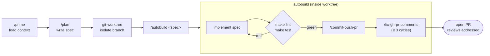
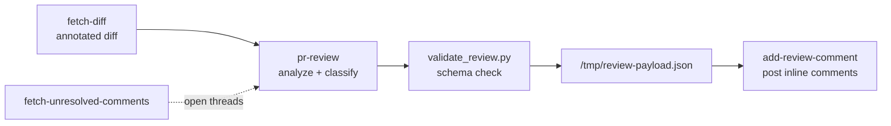

# agent-harness

> `boss-dev` · **v0.17.0** · MIT · part of the [`boss-skills`](../../../README.md) marketplace

Agent harness tooling for Claude Code: subagents, commands, hooks, skills, and scripts that build
and operate agentic dev workflows. It bundles several families of skills — a GitHub PR-review
workflow, a git-worktree lifecycle, a release-notes generator, and a portable security-review
skill — alongside planning, priming, and shipping commands, a roster of subagents, and a library
of lifecycle hooks, output styles, and status lines.

## Installation

```bash
/plugin marketplace add bossjones/boss-skills   # once
/plugin install agent-harness@boss-skills
```

## Components at a glance

| Component | Count | Auto-active on install? | Invoked as |
| --- | --- | --- | --- |
| [Skills](#skills) | 15 | ✅ Yes | Loaded by Claude when relevant, or `/<skill>` |
| [Commands](#commands) | 13 | ✅ Yes | `/agent-harness:<name>` |
| [Agents](#agents) | 6 | ✅ Yes | Dispatched via the `Agent`/`Task` tool |
| [Output styles](#output-styles) | 8 | ✅ Yes | `/output-style` |
| [Hooks](#hooks) | 13 | ⚙️ Manual wiring | Lifecycle events (see [Manual wiring](#manual-wiring)) |
| [Status lines](#status-lines) | 10 | ⚙️ Manual wiring | `statusLine` setting |

Skills, commands, agents, and output styles are discovered and active immediately after
`/plugin install`. Hooks and status lines ship as a **library** and require a one-time
[manual wiring](#manual-wiring) step before they take effect.

## Skills

Skills under `skills/<skill-name>/SKILL.md`. The families below cover the PR-review workflow, the
git-worktree lifecycle, release notes, and machine setup; see [docs/skills.md](./docs/skills.md) for
the complete, current list.

**PR review workflow** (adapted from the [mlflow](https://github.com/mlflow/mlflow) skills,
Apache-2.0):

| Skill | Description |
| --- | --- |
| `fetch-diff` | Fetch a GitHub PR diff with old/new line numbers and auto-generated-file masking, optionally filtered to file globs. |
| `fetch-unresolved-comments` | Fetch only the unresolved PR review threads via the GitHub GraphQL API, grouped by file. |
| `pr-review` | Review a PR and emit a schema-validated local review payload — inline comments plus an approve-or-comment decision. |
| `add-review-comment` | Post a single inline review comment to a PR line or line range via the GitHub API. |

**Git worktree lifecycle** (adapted from
[claude-code-ultimate-guide](https://github.com/FlorianBruniaux/claude-code-ultimate-guide), MIT):

| Skill | Description |
| --- | --- |
| `git-worktree` | Create an isolated worktree for feature development with branch naming, dependency symlinking, and background verification. |
| `git-worktree-status` | Report background type-check, test, and build status for a worktree. |
| `git-worktree-remove` | Safely remove one worktree with branch cleanup and safety checks. |
| `git-worktree-clean` | Batch-clean stale and merged worktrees with a disk-usage report. |

**Release notes** (adapted from claude-code-ultimate-guide, MIT):

| Skill | Description |
| --- | --- |
| `release-notes-generator` | Generate release notes in three formats (CHANGELOG.md, PR body, Slack announcement) from git commits. |

**Machine setup:**

| Skill | Description |
| --- | --- |
| `setup-second-brain` | Install/configure the obsidian-wiki uv tool plus optional [QMD](https://github.com/tobi/qmd) semantic search (detect → preview → apply, with backups and a `--dry-run` diff). Needs `node` ≥ 22 for the optional QMD step. |

**Security review:**

| Skill | Description |
| --- | --- |
| `boss-security-review` | Review changed code (or a named path / whole repo) against a bundled security rubric — and the target repo's `.cursor/rules/security-*` when present — and write a severity-graded findings report to `specs/security-review.md` (path overridable), citing the rule each finding triggered. Portable: bundles verbatim rule copies so it works in any repo. |

The `fetch-diff`, `fetch-unresolved-comments`, and `pr-review` skills carry standalone PEP 723
scripts under `scripts/`, invoked with `uv run "${CLAUDE_SKILL_DIR}/scripts/<script>.py"` — `uv`
resolves their dependencies on demand, so the skills work after `/plugin install` with no extra
setup.

## Commands

Twelve slash commands under `commands/*.md`, auto-discovered on `/plugin install` and namespaced as
`/agent-harness:<name>`.

| Command | Arguments | Purpose |
| --- | --- | --- |
| `prime` | — | Load context for a new session by scanning the codebase, README, and docs. |
| `question` | `[question]` | Answer questions about project structure and docs without writing code. |
| `plan` | `[user prompt]` | Produce a concise engineering plan and save it to the specs directory. |
| `plan_w_team` | `[user prompt] [orchestration prompt]` | Produce a team-orchestrated plan with task dependencies and builder/validator assignments (model: opus). |
| `build` | `[path-to-plan]` | Read a plan file and implement it, then report the completed work. |
| `autobuild` | `<spec-path>` | Implement a spec inside a linked git worktree, then verify, commit, push, open a PR, and address review comments (model: opus). |
| `commit-push-pr` | — | Stage specific files, write a conventional commit, push, and open or reuse a GitHub PR. |
| `fix-gh-pr-comments` | `[pr-number]` | Triage unresolved PR review comments, apply fixes, push, reply per-thread, and poll for new comments (≤ 3 cycles). |
| `debug-ci` | `[run-id]` | Diagnose a failed GitHub Actions run, fix locally, push, and poll the new run until green (≤ 3 cycles). |
| `update_status_line` | `<session_id> <key> <value>` | Upsert a key/value pair into a session's status-line data file. |
| `all_tools` | — | List every available tool as TypeScript-style signatures with purposes. |
| `sentient` | — | Demo command that triggers the `rm -rf` guard in `pre_tool_use.py`. |

## Agents

Six subagent definitions under `agents/`, auto-discovered on `/plugin install` and namespaced as
`agent-harness:<name>`.

| Agent | Model | Purpose |
| --- | --- | --- |
| `meta-agent` | opus | Generate a complete sub-agent configuration file from a plain-language description. |
| `llm-ai-agents-and-eng-research` | default | Research the latest LLM, AI-agent, and engineering developments. |
| `work-completion-summary` | default | Announce concise audio (TTS) summaries when work finishes. |
| `hello-world-agent` | default | Minimal greeting agent — a template/reference example. |
| `team/builder` | opus | Execute a single engineering task: write code, create files, implement features. |
| `team/validator` | opus | Read-only check that a task met its acceptance criteria. |

`team/builder` and `team/validator` back the `/agent-harness:plan_w_team` orchestration workflow.
`meta-agent`, `llm-ai-agents-and-eng-research`, and `work-completion-summary` reference external MCP
tools (firecrawl, ElevenLabs) that must be configured separately. Note that Claude Code ignores
`hooks`/`mcpServers` frontmatter on plugin-shipped agents for security, so `team/builder`'s inline
lint and type-check hooks take effect only when that agent file is used outside the plugin.

## Workflows

### Plan → worktree → build → ship

The planning and shipping commands chain into a single isolated feature loop. `autobuild` runs only
inside a linked git worktree and reuses `commit-push-pr` and `fix-gh-pr-comments` rather than
duplicating their logic.



```text
/agent-harness:prime
/agent-harness:plan add a --json flag to the download script
# launch an isolated worktree session, then inside it:
/agent-harness:autobuild specs/add-json-flag.md
```

### PR review chain

The four PR-review skills compose. Ask Claude in natural language — it runs the skills in order —
or invoke the bundled scripts directly.



```text
Review PR #142 in this repo and draft inline comments.
```

```bash
# Or drive the scripts directly:
uv run "${CLAUDE_SKILL_DIR}/scripts/fetch_diff.py" --help
```

### Triage CI and review feedback

```text
/agent-harness:debug-ci              # find the failed run, fix, push, poll until green
/agent-harness:fix-gh-pr-comments 142  # apply + reply to unresolved review comments
```

## Hooks

`hooks/` ships a **library** of lifecycle hook scripts (PEP 723, run via `uv`). They are **not
active on install** — Claude Code only registers plugin hooks declared in `hooks/hooks.json` (or an
inline `hooks` key in `plugin.json`). See [Manual wiring](#manual-wiring) to enable them.

| Script | Event | Purpose |
| --- | --- | --- |
| `session_start.py` | SessionStart | Log start; optionally inject git/project context or announce via TTS. |
| `snyk_agent_scan.py` | SessionStart | Opt-in advisory Snyk agent-scan of this project's SKILL.md artifacts (see below). |
| `setup.py` | Setup | Check dependencies, detect project type, install packages for CI/`--init` runs. |
| `user_prompt_submit.py` | UserPromptSubmit | Log prompts, manage session metadata, optionally name the agent via an LLM. |
| `pre_tool_use.py` | PreToolUse | Block dangerous `rm -rf` and `.env` access; log tool calls. |
| `permission_request.py` | PermissionRequest | Auto-allow read-only operations; log permission requests. |
| `post_tool_use.py` | PostToolUse | Log successful tool executions. |
| `post_tool_use_failure.py` | PostToolUseFailure | Log tool failures with error detail. |
| `notification.py` | Notification | Log notifications; optionally announce via TTS. |
| `tmux_notify.py` | Notification (filtered), Stop, StopFailure | Opt-in tmux-aware desktop notification that jumps to the waiting pane on click (see below). |
| `subagent_start.py` | SubagentStart | Log subagent spawns; optional TTS announcement. |
| `subagent_stop.py` | SubagentStop | Log subagent completion; summarize and announce via TTS. |
| `pre_compact.py` | PreCompact | Log compaction; optionally back up the transcript. |
| `stop.py` | Stop | Log session stop; optional transcript export and TTS completion message. |
| `session_end.py` | SessionEnd | Log session end; optionally clean up stale temp files. |

Supporting modules:

- `hooks/validators/` — PostToolUse and Stop validators: `ruff_validator.py` and `ty_validator.py`
  lint and type-check Python after writes; `validate_new_file.py` and `validate_file_contains.py`
  assert a file was created or contains expected content.
- `hooks/utils/llm/` — pluggable LLM backends (`oai.py`, `anth.py`, `ollama.py`) and
  `task_summarizer.py` for generating completion messages.
- `hooks/utils/tts/` — text-to-speech backends (`pyttsx3_tts.py`, `openai_tts.py`,
  `elevenlabs_tts.py`) and `tts_queue.py`, a file-lock queue that serializes overlapping
  announcements.
- `hooks/utils/snyk.py` — shared Snyk agent-scan helper (target resolution, scan invocation,
  severity parsing) used by both `snyk_agent_scan.py` and the repo's pre-commit hook.

Hook runs write structured JSON to `logs/` for auditing and debugging.

### tmux desktop notifications (opt-in)

Claude Code's built-in desktop notifications don't survive **tmux** (it emits plain OSC sequences;
tmux needs DCS passthrough). `tmux_notify.py` sidesteps that: wired in parallel under three events,
it fires a desktop notification in the situations that matter, and on macOS attaches a click action
that runs `tmux switch-client` / `select-window` to jump you straight to the exact `session:window`
where Claude is waiting.

| Event | When it fires | Notification |
| --- | --- | --- |
| `Notification` (filtered) | `permission_prompt`, `idle_prompt`, or `elicitation_dialog` only — not `auth_success` or elicitation echo events | "Claude Code — Waiting for you: &lt;message&gt;" |
| `Stop` | Claude finishes responding normally | "Claude Code — Response finished" |
| `StopFailure` | Turn ends on an API error (rate_limit, overloaded, server_error, …) | "Claude Code — Turn failed: &lt;error_type: error_message&gt;" |

**Default off.** Enable it via the plugin's `userConfig` (configured at `/plugin install` /
`/plugin config`, no manual `settings.json` editing):

| Config key | Type | Default | Purpose |
| --- | --- | --- | --- |
| `tmux_notifications` | boolean | `false` | Master toggle. Off → the hook is a silent no-op. |
| `tmux_notify_activate_bundle_id` | string | `com.mitchellh.ghostty` | macOS bundle id of your terminal to raise on click. Blank → skip activation. |
| `tmux_notify_sound` | boolean | `false` | Play the default notification sound (macOS). |

These export to the hook as `CLAUDE_PLUGIN_OPTION_TMUX_NOTIFICATIONS`,
`CLAUDE_PLUGIN_OPTION_TMUX_NOTIFY_ACTIVATE_BUNDLE_ID`, and `CLAUDE_PLUGIN_OPTION_TMUX_NOTIFY_SOUND`.

**Prerequisites:** `tmux`, plus a notifier —

```bash
brew install terminal-notifier   # macOS
sudo apt install libnotify-bin    # Linux (provides notify-send)
```

Example terminal bundle ids: `com.mitchellh.ghostty`, `com.googlecode.iterm2`, `dev.warp.Warp`,
`com.apple.Terminal`.

**Graceful degradation.** With the toggle off (or on an older Claude Code that ignores
`userConfig`), the hook exits immediately and does nothing. When on: outside tmux it still notifies,
just without the click-to-jump action; if `terminal-notifier` is missing it falls back to
`notify-send`, then to a terminal bell. The script always exits `0` and never blocks the hook chain.

**Limitations:** Linux click-to-jump is not supported (`notify-send` action buttons need a running
listener) — the tmux target is shown in the notification body instead. There is no bats/pytest
harness for this script in this release.

### Snyk agent-scan (opt-in, advisory)

[Snyk `agent-scan`](https://github.com/snyk/agent-scan) is an AI-agent supply-chain scanner for
skill/agent artifacts — it flags prompt injection, tool poisoning, and hidden-Unicode obfuscation
in `SKILL.md` files. `snyk_agent_scan.py` runs it at `SessionStart` against the current project's
skill artifacts and, separately, a repo-local pre-commit hook (`scripts/snyk-agent-scan.py`) runs
it over staged `SKILL.md` files.

**Default off**, and fail-open throughout — disabled, no token, no targets, or a scanner
error/timeout all silently no-op; neither hook ever blocks a session or a commit by default.

| Config key | Type | Default | Purpose |
| --- | --- | --- | --- |
| `ENABLE_SNYK_AGENT_SCAN` | boolean | `false` | Master toggle. Off → both hooks are a silent no-op. |
| `SNYK_TOKEN` | string | _(empty)_ | Snyk API token. Falls back to a bare `SNYK_TOKEN` env var / `.env` if unset here. |

Both resolve through the same `CLAUDE_PLUGIN_OPTION_<KEY>` → bare-env-var resolution order as
`ENABLE_TTS`/`ENGINEER_NAME` above.

**Scope.** Only `SKILL.md` files are scanned — the scanner treats any other markdown path (an
`agents/*.md` or `commands/*.md` file) as an MCP JSON config and fails to parse it, so those paths
are never worth passing to it. Neither hook ever passes `--ci` or `--dangerously-run-mcp-servers`,
so scanning never launches an MCP stdio server.

**SessionStart** is always advisory: it injects a one-line findings summary as
`additionalContext` when Critical/High/Medium/Low findings are present, stays silent on a clean
scan, and throttles re-scans of the same project to once every 6 hours.

**Pre-commit** is advisory by default (prints findings, exits `0`) unless
`SNYK_AGENT_SCAN_ENFORCE=1`, in which case it exits `1` when Critical/High findings are staged.
Exit codes from the scanner itself are never trusted for gating — empirically it exits `0` even
with High-risk findings present — so both hooks parse `--json` severities directly.

## Output styles

Eight output styles under `output-styles/*.md`, auto-discovered on `/plugin install` and selectable
with `/output-style`.

| Style | Description |
| --- | --- |
| `markdown-focused` | Full markdown toolbox — headers, tables, blockquotes, task lists. |
| `bullet-points` | Hierarchical bullet lists, broad to specific. |
| `table-based` | Markdown tables for comparisons, steps, and analysis. |
| `ultra-concise` | Minimal words, fragments over sentences, code-first. |
| `yaml-structured` | Machine-readable YAML with hierarchical key/value blocks. |
| `html-structured` | Semantic HTML5 with data attributes for programmatic use. |
| `genui` | Generative UI — writes a styled, self-contained HTML page to `/tmp/` and opens it. |
| `tts-summary` | Announces task completion as audio (experimental). |

## Status lines

`status_lines/` ships ten status-line scripts (PEP 723, `python-dotenv`) — progressively richer
takes on the Claude Code status line. They are a library, not auto-wired: point your `statusLine`
setting at one to use it.

| Script | Shows |
| --- | --- |
| `status_line.py` | Model, directory, git branch, version. |
| `status_line_v2.py` | Adds the last user prompt. |
| `status_line_v3.py` | Adds agent name and the last three prompts (fading). |
| `status_line_v4.py` | Adds custom key/value pairs (see `update_status_line`). |
| `status_line_v5.py` | Session cost, lines added/removed, duration. |
| `status_line_v6.py` | Context-window usage bar and tokens remaining. |
| `status_line_v7.py` | Elapsed session time and start time. |
| `status_line_v8.py` | Input/output token counts and cache stats. |
| `status_line_v9.py` | Minimal powerline layout (model, branch, path, context %). |
| `status_line_v10.py` | Context-window usage bar plus a running session cost from list pricing. |

## Manual wiring

Hooks and status lines ship as a library — opt in by editing your settings.

**Enable a hook** — add an entry to `hooks/hooks.json` (or an inline `hooks` key in `plugin.json`)
that points at the script with `${CLAUDE_PLUGIN_ROOT}`:

```json
{
  "hooks": {
    "PreToolUse": [
      {
        "matcher": "Bash|Write|Edit",
        "hooks": [
          { "type": "command", "command": "uv run \"${CLAUDE_PLUGIN_ROOT}\"/hooks/pre_tool_use.py" }
        ]
      }
    ]
  }
}
```

**Enable a status line** — point your `statusLine` setting at one of the scripts:

```json
{
  "statusLine": {
    "type": "command",
    "command": "uv run \"${CLAUDE_PLUGIN_ROOT}\"/status_lines/status_line_v10.py"
  }
}
```

## Status

Plugin version **v0.16.0**. Skills, commands, agents, and output styles are auto-discovered and
active on `/plugin install`. The hook scripts and status lines ship as a library and require manual
wiring — a `hooks/hooks.json` entry for hooks, a `statusLine` setting for status lines — before they
take effect.

## See also

- Expanded reference: [`docs/plugins/agent-harness.md`](../../../docs/plugins/agent-harness.md)
- Marketplace index: [`docs/plugins/README.md`](../../../docs/plugins/README.md)
- Repo root: [`README.md`](../../../README.md)
