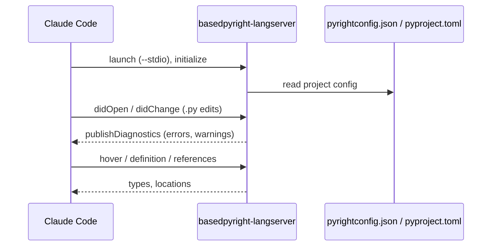

# basedpyright-lsp

> `boss-dev` · **v0.1.1** · MIT · part of the [`boss-skills`](../../../README.md) marketplace

LSP plugin that wires [basedpyright](https://docs.basedpyright.com/) into Claude Code, giving Claude
real-time Python diagnostics, hover docs, go-to-definition, and find-references while editing Python
code. The plugin is a thin configuration shim — it ships a single `.lsp.json` and delegates all
analysis to the `basedpyright-langserver` binary, which you install separately.

## Capabilities

Once the language server attaches, Claude gains these editor features for `.py`, `.pyi`, and `.pyw`
files:

| Capability | What you get |
| --- | --- |
| Real-time diagnostics | Type errors and lint findings surface as you edit, in the `/plugin` **Errors** tab. |
| Hover documentation | Inferred types and docstrings on hover over a symbol. |
| Go-to-definition | Jump to where a symbol is defined. |
| Find references | Locate every usage of a symbol across the project. |
| Semantic tokens | Full semantic highlighting (a feature Microsoft removed from pyright). |
| Inlay hints | Inline type annotations for inferred values. |
| Baseline files | Suppress pre-existing findings so only new issues surface. |

## Why basedpyright (not pyright)?

basedpyright is a community fork of Microsoft's pyright. The table below summarizes the differences
that motivate this plugin:

| Aspect | pyright | basedpyright |
| --- | --- | --- |
| Check coverage | Baseline | **Strict superset** — everything pyright catches, plus rules like `reportImplicitOverride` |
| LSP surface | Trimmed by Microsoft | Re-adds full semantic tokens, inlay hints, baseline files |
| Configuration | `pyrightconfig.json`, `[tool.pyright]` | **Same files** — reads `[tool.pyright]` and `[tool.basedpyright]` |
| Distribution | Node toolchain | **Single binary** installable via `uv` |
| Claude Code plugin | Anthropic's official `pyright-lsp` | This plugin |

Anthropic's official marketplace already provides `pyright-lsp`, so this plugin exists to cover
basedpyright users specifically. If you want vanilla pyright instead, install `pyright-lsp` from the
official marketplace.

## Prerequisites

- **Claude Code 2.1.50 or later** (LSP plugin support).
- **basedpyright installed and on `PATH`**:

  ```bash
  uv tool install basedpyright       # recommended
  # or
  pip install basedpyright           # if you don't use uv
  ```

  Verify the binary is available:

  ```bash
  basedpyright-langserver --help
  ```

## Installation

Add the marketplace and install the plugin:

```text
/plugin marketplace add bossjones/boss-skills
/plugin install basedpyright-lsp@boss-skills
```

Restart Claude Code (or run `/reload-plugins`) so the LSP server attaches.

## How it works

The plugin's `.lsp.json` tells Claude Code how to launch and talk to the language server. Claude
Code spawns `basedpyright-langserver` once per session and exchanges LSP messages with it over
stdio; the server reads your project's pyright/basedpyright configuration to decide how strict to
be.



### `.lsp.json` reference

| Key | Value | Purpose |
| --- | --- | --- |
| `command` | `basedpyright-langserver` | The executable Claude Code launches. |
| `args` | `["--stdio"]` | Communicate over standard input/output. |
| `transport` | `stdio` | Transport mechanism. |
| `extensionToLanguage` | `.py`, `.pyi`, `.pyw` → `python` | File extensions mapped to the `python` language ID. |
| `initializationOptions` | `{}` | None — server uses project config. |
| `settings` | `{}` | None — server uses project config. |
| `maxRestarts` | `3` | Restart the server up to three times if it crashes. |

## Configuration

This plugin ships **no opinions** about strictness. Configure basedpyright per-project the same way
you'd configure pyright:

- `pyrightconfig.json` at the project root, **or**
- `[tool.basedpyright]` (or `[tool.pyright]`) in `pyproject.toml`

Example `pyproject.toml`:

```toml
[tool.basedpyright]
include = ["src"]
pythonVersion = "3.13"
typeCheckingMode = "strict"
reportImplicitOverride = "error"
```

See the [basedpyright configuration docs](https://docs.basedpyright.com/latest/configuration/config-files/)
for the full option list.

## Verification

After installing the plugin:

1. Open any `.py` file in a project that uses basedpyright.
2. Run `/plugin` and check the **Errors** tab is clean for `basedpyright-lsp`.
   `Executable not found in $PATH` means the prerequisite step above failed — install basedpyright
   and restart.
3. Introduce an obvious type error (`x: int = "string"`) and confirm Claude sees a diagnostic.

## Troubleshooting

| Symptom | Cause | Fix |
| --- | --- | --- |
| `Executable not found in $PATH` | basedpyright isn't installed for the shell Claude Code launches. | `uv tool install basedpyright`, then confirm with `which basedpyright-langserver`. |
| LSP doesn't attach | Claude Code is older than 2.1.50. | Upgrade to 2.1.50+. On older builds, `npx tweakcc --apply` once enables LSP plugin support. |
| No diagnostics surface | No basedpyright config, or the file has no project root. | Add a config (or remove all configs to use defaults); open the file within a project root. |

## See also

- Expanded reference: [`docs/plugins/basedpyright-lsp.md`](../../../docs/plugins/basedpyright-lsp.md)
- Marketplace index: [`docs/plugins/README.md`](../../../docs/plugins/README.md)
- Repo root: [`README.md`](../../../README.md)

## License

MIT
