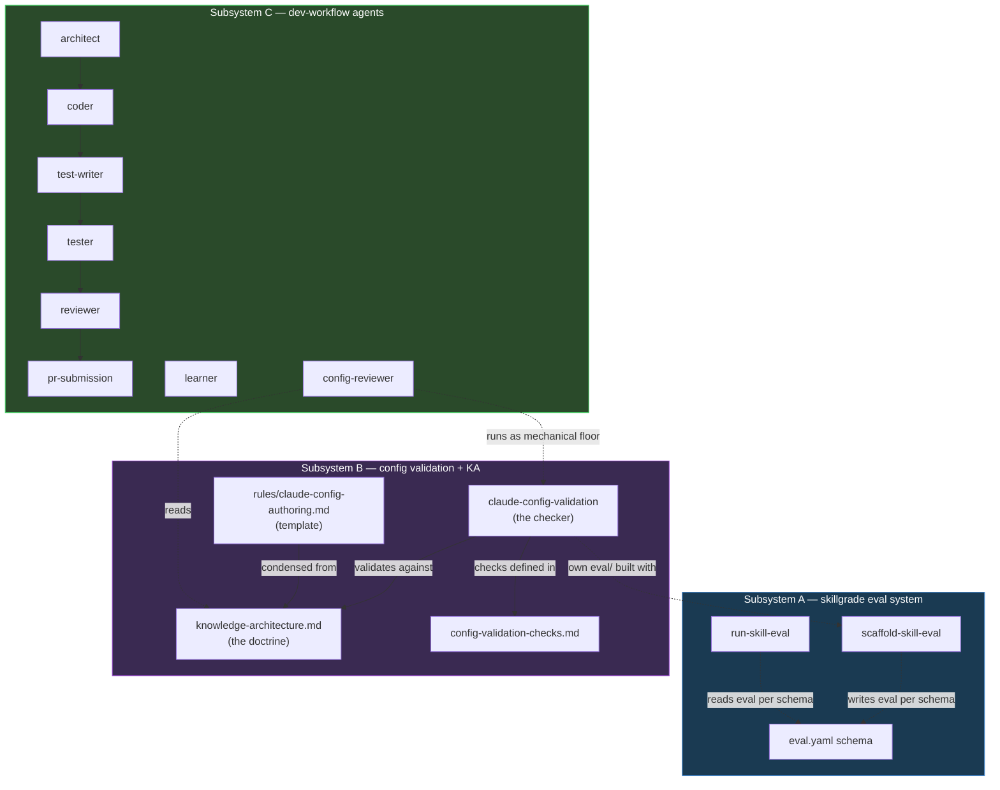
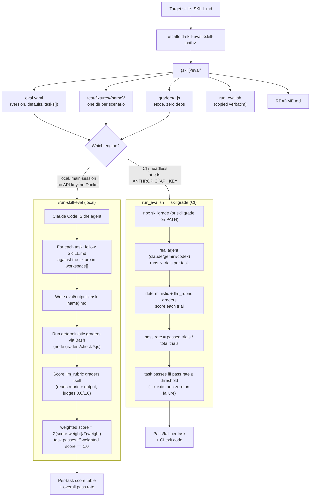

# Architecture Overview

`boss-experimental` is not one system — it's three, packaged together because they share an
origin (a genericized port of tooling from a larger internal monorepo) and a target user
(someone authoring or auditing Claude Code skills/agents in *any* repo). This document covers
each subsystem and how — if at all — they touch each other.

## Subsystem A: the skillgrade skill-eval system

**Question it answers:** *"When an agent actually runs this skill against a task, does the
outcome pass?"*

Two skills implement this:

- [`scaffold-skill-eval`](../skills/scaffold-skill-eval/SKILL.md) generates a complete `eval/`
  directory for a target skill: fixtures, Node graders, `eval.yaml`, `run_eval.sh`, `README.md`.
- [`run-skill-eval`](../skills/run-skill-eval/SKILL.md) executes that `eval/` **locally**, with
  Claude Code itself acting as the agent under test — no API key, no Docker, no `skillgrade`
  CLI required.

The same `eval.yaml` also drives a **CI / headless** path: `run_eval.sh` (copied verbatim from
`scaffold-skill-eval`'s reference implementation into each skill's `eval/`) delegates to the
[`skillgrade`](https://www.npmjs.com/package/skillgrade) npm CLI, which runs N real trials
against a pass-rate threshold using a real LLM agent (`gemini`, `claude`, or `codex`).

One `eval.yaml`, two execution engines, same contract. See
[`02-components.md`](02-components.md#component-a-skillgrade-eval-skills) for the full
skill-by-skill contract and [`03-grader-api.md`](03-grader-api.md) for how graders work.

### Why two engines instead of one

- The **local** engine (`/run-skill-eval`) needs nothing beyond Claude Code itself. It is the
  fast, keyless loop for iterating on a skill and its eval during authoring.
- The **CI** engine (`run_eval.sh` → `skillgrade`) is what a pipeline would run headlessly, with
  real multi-trial statistical confidence (`trials`, `threshold`) and a real external agent.
  It costs an API call and needs `ANTHROPIC_API_KEY`.

Both read the identical `eval.yaml` — nothing in the schema is engine-specific. See
[`references/skillgrade-eval-yaml-schema.md`](../references/skillgrade-eval-yaml-schema.md) for
the full field reference.

### Relationship to this repo's existing eval stack

This repo already runs a **separate** eval stack for skill quality: `/skill-evals`,
`make eval-skill`, `scripts/plugin_eval/`. That stack asks *"is this skill well-authored?"* via
static analysis plus an optional LLM judge over the `SKILL.md` itself. Skillgrade asks a
different question — *"does the skill actually work end-to-end?"* — via live execution against
fixtures. **Boss-experimental does not modify, replace, wrap, or depend on the existing stack.**
The two are meant to be run side by side and compared. Full comparison table:
[`references/skillgrade-vs-plugin-eval.md`](../references/skillgrade-vs-plugin-eval.md).

## Subsystem B: config validation + knowledge architecture

**Question it answers:** *"Does this project's `.claude/` configuration follow a sound
placement doctrine?"*

- [`references/knowledge-architecture.md`](../references/knowledge-architecture.md) is the
  doctrine itself — a long-form reference on where knowledge belongs across five facilities
  (CLAUDE.md, Rules, Agents, Skills, Domain Docs) plus enforcement (Hooks) and capabilities
  (Plugins/MCP). It defines the **Placement Test** (seven yes/no questions, first "yes" wins),
  the **Three-Occurrence Rule**, **Monorepo Scoping** (root vs. config-home vs. project), and
  the **Standard Agent Set** that Component C implements.
- [`claude-config-validation`](../skills/claude-config-validation/SKILL.md) is a read-only skill
  that mechanically checks a project against that doctrine — 23 numbered checks across six
  categories (Project Structure, Knowledge Placement, Skill Quality, Discoverability &
  References, Compliance Placement, Loading & Registration). The check definitions live
  separately in [`references/config-validation-checks.md`](../references/config-validation-checks.md)
  so the "what" (checks catalog) and the "how" (procedure) are two files, not one.
- [`references/config-pr-checklist.md`](../references/config-pr-checklist.md) is the two-step
  PR workflow this skill is meant to feed: Step 1 (mechanical, this skill) + Step 2 (judgment,
  a Claude session applying the architecture doc) + Step 3 (paste both results into the PR).
- [`rules/claude-config-authoring.md`](../rules/claude-config-authoring.md) is a condensed
  anti-pattern guardrail derived from the architecture doc, meant to auto-load while editing
  `.claude/**/*.md` or `CLAUDE.md` files. **It is a template, not a live rule** — see the caveat
  below.

`claude-config-validation` **also dogfoods Subsystem A**: it ships its own worked
`eval/` (13 fixtures, 4 Node graders, a hand-authored `eval.yaml`) as *the* reference example of
"a well-formed skill with a proper eval," and `scaffold-skill-eval`'s own `SKILL.md` points back
at it as the reference skill to study.

> **Caveat — the authoring rule does not auto-load.** Claude Code plugins auto-discover skills,
> agents, hooks, and MCP/LSP servers, but there is no plugin-level `rules/` component. Path-scoped
> rules only auto-load from a *project's* `.claude/rules/*.md`. To get the "coach me while I edit
> `.claude` config" behavior for real, symlink or copy
> `rules/claude-config-authoring.md` into your own project's `.claude/rules/`.

## Subsystem C: dev-workflow agents

**Question it answers:** *"What does an orchestrated implement → test → review → ship pipeline
look like, generically, with no project-specific assumptions baked in?"*

Eight agents under [`agents/`](../agents/), each a genericized port with no hardcoded project
paths, package names, or languages — domain knowledge is expected to come from the substrate
(the invoking project's `CLAUDE.md`, docs, and rules) at runtime, per the knowledge-architecture
doctrine:

`architect` → `coder` → `test-writer` → `tester` → `reviewer` → `pr-submission`, plus
`learner` (self-improvement, runs after a workflow iteration) and `config-reviewer` (a
governance role, read-only, operates on `.claude/` configs rather than code).

`config-reviewer` is the one place Component C touches Component B: its "Required Reading" and
"Mechanical checks" sections explicitly point at
`plugins/boss-experimental/boss-experimental/skills/claude-config-validation/SKILL.md` and
`references/knowledge-architecture.md`, running the validation skill's checks as a floor before
adding architectural judgment on top. Full per-agent contracts:
[`02-components.md`](02-components.md#component-c-dev-workflow-agents).

> **Overlap note.** These agents overlap in role with `agent-harness`'s existing team agents
> (`builder`, `validator`). Treat this canonical set as **experimental/optional** — it is not a
> repo mandate, and using Components A or B does not require adopting it.

## How the three subsystems relate

The only hard edges are: B dogfoods A (its `eval/` is scaffolded/run the same way any other
skill's would be), and C's `config-reviewer` depends on B (both the skill and the doctrine doc).
Everything else is independent and can be adopted piecemeal.

## Eval data-flow diagram (Subsystem A, in detail)

This is the flow the task explicitly asks to diagram: scaffold → `eval.yaml` + fixtures +
graders → local `/run-skill-eval` **or** CI `skillgrade` → scores.

Key asymmetry: in the **local** path, Claude Code plays two roles — the agent under test *and*
the `llm_rubric` grader (it reads the rubric text and scores its own output file honestly,
per the strictness instruction in `run-skill-eval`'s `SKILL.md`). In the **CI** path, skillgrade
owns both roles via its own agent/grader machinery — this plugin only supplies the `eval.yaml`,
the fixtures, and the graders.
